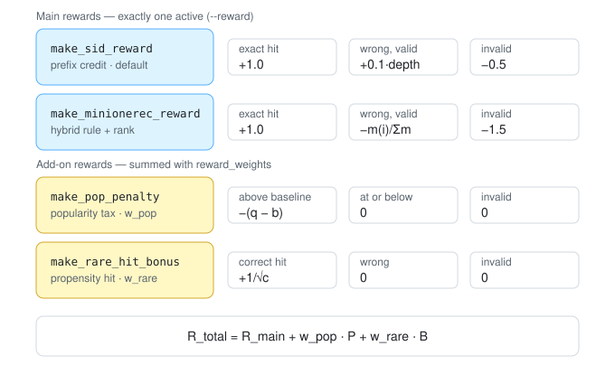

# llm4rec-bias

A minimal, locally-runnable LLM4Rec pipeline on MovieLens-100K for studying
**RL shortcut / bias mitigation** in recommendation. Scaled-down version of the
[RL-Shortcut-Lab execution spec](https://rl-shortcut-lab.myflorey111.chatgpt.site/zh/literature)
(MLLMRec-R1 route): LoRA SFT → LoRA merge →
GRPO with KL constraint, with the four bias-cue dimensions controllable in the
data layer and measured by dedicated probes.

Runs on an Apple-silicon Mac (tested: M3, 16 GB) with `Qwen/Qwen2.5-0.5B-Instruct`.

Two task routes are implemented:

| | Route 1: letter choice | Route 2: semantic-ID generative retrieval (recommended) |
|---|---|---|
| Task | pick among 10 lettered candidates | generate the next item's semantic ID; scored against the **full catalog** |
| Spec analogue | MLLMRec-R1 (discriminative form) | MiniOneRec |
| Item identity | letters A–J per prompt | global `<s0_i><s1_j><s2_k><s3_c>` codes; similar movies share prefixes |
| Files | `data / sft / grpo / eval / reward` | `semid / sid_data / sid_sft / sid_grpo / sid_eval / sid_reward` |

## Findings

Nineteen stage-2 checkpoints on the semantic-ID route — reward designs under
GRPO, a KL-strength test, LoRA-capacity runs, seed replicates, and four runs of
a reward-free distillation trainer. All start from the same SFT checkpoint and
are scored the same way (300 test users, constrained-beam retrieval over 1,682
items). Details and tables are in
[Route 2](#route-2-semantic-id-generative-retrieval).

> **Scope note.** An earlier version of this section surveyed only the r=16
> reward-design runs and generalized from them. The `r64` / `r64tok`
> checkpoints (LoRA rank 64) and the `w1_s1` / `w1_s2` seed replicates were
> already in `runs/` and are now included; two findings changed materially as a
> result, and are marked below.

**1. No reward design moved the bias.** Seven configurations — prefix credit,
the MiniOneRec rank-aware hybrid, catalog and user-anchored popularity taxes, a
propensity-weighted rare-hit bonus, and SDA in two forms — land in
ΔGAP **+0.163 … +0.196** around an SFT baseline of +0.188, where

$$\Delta\mathrm{GAP} = \frac{1}{N}\sum_u\Big(q(\hat\imath_u) - \tfrac{1}{|H_u|}\textstyle\sum_{j\in H_u} q(j)\Big)$$

The one that helped, barely, is the crudest — a flat popularity penalty
$P(i_k) = -[\,q(i_k)-\bar q_\mathcal{C}\,]_+$ at $w=1.0$ (+0.163). The
propensity-weighted rare-hit bonus never fired at all
(`bonus/rare_hit_mean` ≈ 0.0004).

⚠️ **That +0.163 is the best of three seeds, not a stable effect.** The same
configuration re-run gives **+0.163 / +0.182 / +0.186** (`pop_w1`, `w1_s1`,
`w1_s2`), straddling the SFT baseline of +0.188. Earlier revisions of this
document cited +0.163 as a fixed reference point in several comparisons; it
should be read as +0.18 ± 0.01 across seeds. Almost none of the differences
among the reward designs survive that spread.

**2. β is not the binding constraint, contrary to what this README argued at
length.** The claim under test was that the regularizer in

$$\mathcal{L} = -\mathbb{E}\big[A\cdot\log\pi\big] + \beta\,D_{\mathrm{KL}}\big(\pi\,\|\,\pi_{\mathrm{SFT}}\big)$$

holds the policy where the bias already is. A 4× looser leash changed mean KL by
**1.07×** (0.0213 → 0.0228) and ΔGAP by **0.0003**. At β=0.04 the penalty
contributes $\beta D \approx 0.04\times0.05 = 0.002$ against advantage-weighted
terms of order $|A|\approx 1$. What actually binds is the optimization budget:
$300 \times 4 / 3724 =$ **0.32 epochs** at lr 5e-6. Raising lr 4× moved KL 6×.

**3. Pointing the objective at an unbiased target does not make the policy
unbiased.** Debiasing the target directly,

$$\tilde P^{*}(i) = \frac{P^{*}(i)\,/\,c(i)^{\gamma}}{\sum_{j\in\mathcal{I}} P^{*}(j)\,/\,c(j)^{\gamma}}, \qquad \gamma = 0.3$$

reaches ΔGAP **+0.023** at the target. GRPO against it produced a policy at
**+0.191**.

**The sharp version of this, corrected.** An earlier revision claimed "the
objective's ΔGAP spans 0.149 while the policy's spans 0.033," comparing the
target sweep against the reward-design runs only. Including every checkpoint in
`runs/`, the policy's range is **0.316**, and the split is the interesting part:

| what varies | ΔGAP range | span |
|---|---|---|
| **reward design** (7 configs, LoRA r=16) | +0.163 … +0.196 | **0.033** |
| **model capacity** (`r64`, `r64tok`, LoRA r=64) | −0.120 … −0.102 | **0.31 from baseline** |

Rank 64 at the *same* 300 steps and β=0.04 drove final KL to **0.97** (vs 0.05
at r=16), entropy 1.45 → 0.48, and ΔGAP from +0.188 to **−0.120** — past neutral
into under-recommending popular items. So the policy is not immovable, as the
earlier framing implied; it is immovable *by reward design at r=16*. What moves
it is capacity.

That is not a success: r64's HR@10 collapses to **3.0%**, coverage to 2.6%,
Gini to 0.992. It found a degenerate low-popularity mode, not a better
trade-off. But it does relocate the constraint from "the reward" to "how much
the policy is able and permitted to move," alongside the lr evidence in
finding 2.

**4. The reward *formulation* was the problem, not the objective.** The SDA
objective factors along the SID hierarchy, so the KL chain rule splits it with
no hand-set per-level weights:

$$P^{*}(C_1,C_2,C_3)=P^{*}(C_1)P^{*}(C_2|C_1)P^{*}(C_3|C_1,C_2)
\;\Rightarrow\;
\mathcal{L}_{\mathrm{SDA}} = D_1 + D_{2|1} + D_{3|12}$$

Its gradient has **two** estimators, and the repo used the worse one:

$$-\nabla_\theta D_{\mathrm{KL}}(P^{*}\|Q_\theta)
= \underbrace{\mathbb{E}_{s\sim Q_\theta}\!\left[\frac{P^{*}(s)}{Q_\theta(s)}\nabla_\theta\log Q_\theta(s)\right]}_{\text{the reward } R_{\mathrm{SDA}} = P^{*}/Q_\theta}
= \underbrace{\mathbb{E}_{s\sim P^{*}}\big[\nabla_\theta\log Q_\theta(s)\big]}_{\text{plain cross-entropy}}$$

Switching to the right-hand estimator gives the first stage-2 method to beat SFT
on anything:

| | HR@10 | NDCG@10 | Gini ↓ | coverage@10 ↑ |
|---|---|---|---|---|
| SFT (no stage 2) | 7.67% | 0.0390 | 0.972 | 7.4% |
| best of 11 RL runs | 7.33% | 0.0384 | 0.974 | 6.5% |
| distillation, matched budget | **8.67%** | **0.0489** | 0.975 | 7.1% |
| distillation, 1.07 epochs | 8.00% | 0.0366 | **0.967** | **9.6%** |

Why the reward form fails, in two structural steps. A forward KL fights
concentration through *unbounded* ratios — but GRPO divides them away, and with
$G=4$ a group z-score cannot even exceed 1.5:

$$A_k=\frac{R_k-\mu_G}{\sigma_G+10^{-4}}, \qquad |z| \le \frac{G-1}{\sqrt G} = 1.5$$

And the terms that dominate a forward KL are exactly the ones on-policy
sampling never draws:

$$D_{\mathrm{KL}}(P^{*}\|Q_\theta)\to\infty \ \text{ as } Q_\theta(s)\to0,
\qquad \Pr[\,s \text{ drawn}\,]=Q_\theta(s)\to0$$

At Gini 0.97 the policy samples ~100 of 1,682 items, so the coverage term is
absent from every gradient estimate. Both obstacles are structural, not tuning.
The loss form actually run:

$$\mathcal{L} = \alpha\,\mathrm{CE}(i^{*}) + (1-\alpha)\!\!\underset{i_m\sim\tilde P^{*}}{\mathrm{mean}}\!\mathrm{CE}(i_m) + \lambda\,D_{\mathrm{KL}}\big(\bar Q(C_1)\,\|\,\bar P^{*}(C_1)\big)$$

⚠️ **Attribution caveat.** The distillation runs also differ in learning rate
(2e-5 vs 5e-6) and add the α and λ terms, so this experiment does **not**
isolate the estimator as the cause of the numbers. The mechanism argument above
is verified in the trl source and the training logs; the causal claim is not.
The missing control is `--alpha 1.0 --lambda-exp 0` at lr 2e-5 — pure label CE,
no distillation target — which would show how much of the gain is simply more
training at a higher lr.

**5. Nothing moved the tail.** With

$$\mathrm{HR}_T@K = \underset{u\,:\,i^{*}_u\in T}{\mathrm{mean}}\ \mathbf{1}\big[i^{*}_u\in\mathrm{top}K(u)\big]$$

**tail** HR@10 is **0% in every run** (n = 15). **Mid**-tier is 0% in all but
two — `r64` and `w1_s2` each hit exactly **1 of 73** mid targets (1.37%), which
is one user, not a trend. (An earlier revision claimed 0% for mid *and* tail
across all runs; that was checked only over the runs produced in that session.)
IPS-corrected HR@10 is 0.58% against a raw 7.67%. Coverage improves by
recommending more distinct head-adjacent items, not by reaching the tail — and
the two exposure metrics decompose to show it. If $k$ items shared exposure
perfectly equally, Gini would be exactly $1-k/|\mathcal{I}|$, so coverage sets a
floor on Gini and the remainder is inequality *among the items actually shown*:

| | coverage-implied floor | measured Gini | excess |
|---|---|---|---|
| SFT | 0.926 | 0.972 | 0.046 |
| distill 2k | 0.904 | 0.967 | **0.063** |

So the best exposure result in this repo reaches ~37 more movies while
distributing *more* unevenly across the ones it shows. That is a capacity floor
for a 0.5B model over 1,682 items, and no loss or reward design reaches it.

**Reading the table:** the best accuracy and the best exposure numbers come
from *different* checkpoints of the same method, and the best popularity
numbers from a different method entirely. There is no single winner — these
are points on a frontier, and any single-number claim here is cherry-picked.

## Route 1: letter choice

Next-movie **choice**: prompt = user's recent watch history (titles) + C=10
lettered candidates (ground-truth next item among popularity-sampled
negatives); the model answers with a letter. Reward: **+1** correct, **0**
wrong-but-valid, **−0.5** unparseable.

## Bias cues → controls (spec's four dimensions)

| Cue dimension | Control | Probe / metric |
|---|---|---|
| Popularity / exposure | `--neg-sampling pop\|uniform` | `pop_lift` (chosen item's popularity quantile − candidate mean) |
| Position | `--target-pos random\|first\|last\|middle` | full-permutation probe: accuracy-by-target-position curve + `spread`; `chosen_pos_hist` |
| Text framing | `--framing neutral\|evaluative` (popularity markers) | eval same split under both framings, compare HR@1 / pop_lift |
| History recency | `--history N` | regenerate data with different N, compare |

## Pipeline

```bash
uv sync

# 1. Data (downloads ml-100k, ~5MB). Default: pop-weighted negatives, random target position
uv run python -m llm4rec.data --out data

# variant datasets for probes, e.g.:
uv run python -m llm4rec.data --out data --neg-sampling uniform --suffix _uniform
uv run python -m llm4rec.data --out data --framing evaluative --suffix _eval

# 2. Baseline eval (zero-shot base model)
uv run python -m llm4rec.eval --max-examples 300 --position-probe 30 --out runs/eval_base.json

# 3. SFT (LoRA), ~1.2s/step on M3
uv run python -m llm4rec.sft --out runs/sft

# 4. Eval SFT checkpoint
uv run python -m llm4rec.eval --adapter runs/sft/final --max-examples 300 --position-probe 30 --out runs/eval_sft.json

# 5. GRPO on top of merged SFT weights (~4-15s/step depending on batch)
uv run python -m llm4rec.grpo --sft-adapter runs/sft/final --steps 300 --out runs/grpo

# 6. Eval GRPO checkpoint
uv run python -m llm4rec.eval --adapter runs/grpo/final --max-examples 300 --position-probe 30 --out runs/eval_grpo.json
```

GRPO logs per step: `reward`, `kl`, `shortcut/invalid_rate`,
`shortcut/chosen_pos_mean`, `shortcut/pop_lift` — the spec's per-step
deliverables. Checkpoints: base (stage 0), SFT (stage 1), GRPO (stage 2), plus
`save_steps` intermediates.

## Baseline finding (zero-shot, 40 test examples)

The base 0.5B model is already a pure **position-shortcut** policy: it picks
candidate A 70% of the time (rest J). Position probe: accuracy 1.0 when the
target is at slot A, 0.0 everywhere else (spread = 1.0). HR@1 0.15 vs 0.10
chance. So even before RL there is a strong prior cue for training to inflate
or suppress — exactly the phenomenon to track through SFT → GRPO.

## Experiment plan (screening → causal → mitigation)

1. **Screening**: train default pipeline; track `shortcut/*` per step. Compare
   `pop_lift` when trained on pop-sampled vs uniform negatives; position probe
   spread at each stage.
2. **Causal check**: hold content fixed, permute one cue (position probe does
   this; framing A/B does it for text). A cue is causal if choice tracks the
   cue, not the content.
3. **Mitigation** (equal budget comparisons):
   - KL strength sweep (`--beta`) — the generic baseline
   - Cue-randomized training data (position/framing randomization at data level)
   - Reward-side fixes: penalize choices that track the cue (edit `reward.py`)
   - Early stopping at KL/probe thresholds

## Route 2: semantic-ID generative retrieval

Fixes the weakness of per-prompt letter mapping: item identity lives in
**global semantic-ID tokens**, and retrieval runs against the whole catalog
instead of 10 candidates.

**Semantic IDs** (`semid.py`): each item's text ("Title (year). Genres: ...")
is embedded with frozen MiniLM, then residual k-means (3 levels × 64 codes)
quantizes the embeddings; a 4th level breaks collisions. Similar movies share
leading codes (e.g. *Toy Story* and *A Goofy Movie* share a 2-level prefix).
The 196 code tokens are added to the tokenizer; only those embedding rows are
trained (peft `trainable_token_indices`) alongside the usual LoRA adapters.

**Vocabulary sizes** (measured):

| what | size |
|---|---|
| Qwen2.5-0.5B tokenizer (base) | 151,665 tokens |
| semantic-ID code tokens added | 196 (= 3 levels × 64 codes + 4 collision-breakers) |
| tokenizer after adding | 151,861 |
| model embedding rows | 151,936 (Qwen ships slack, so **no resize needed** — sid tokens occupy reserved rows) |
| item catalog | 1,682 movies, each exactly 4 sid tokens (64³ = 262,144 addressable IDs) |
| distinct tokens actually used in the sid dataset (prompts + answers) | 2,584 |

The effective *output* vocabulary of the task is just the 196 code tokens (plus
EOS): every answer is 4 codes, and constrained decoding walks a trie whose
root branches over at most 64 level-0 tokens.

**Task**: history (titles + sids) → generate the next item's sid.
**Reward** (`sid_reward.py`): 1.0 exact item; else `0.1 ×` matching leading
levels (semantic-closeness credit — itself a researchable shortcut, disable
with `--prefix-credit 0`); −0.5 invalid ID. Telemetry per GRPO step:
`shortcut/invalid_rate`, `shortcut/pop_lift`, `shortcut/prefix_depth`.
**Eval** (`sid_eval.py`): constrained beam search over the trie of valid IDs →
top-K catalog ranking → HR@1/HR@10/NDCG@10, `pop_lift@1`, plus unconstrained
generation validity.

```bash
uv run python -m llm4rec.semid    --out data          # build semantic_ids.json
uv run python -m llm4rec.sid_data --out data          # sid_{train,val,test}.jsonl + item_meta.json
uv run python -m llm4rec.sid_sft  --out runs/sid_sft  # stage 1 (~40 min on M3)
uv run python -m llm4rec.sid_eval --adapter runs/sid_sft/final --max-examples 300 --out runs/eval_sid_sft.json
uv run python -m llm4rec.sid_grpo --sft-adapter runs/sid_sft/final --steps 300 --out runs/sid_grpo
uv run python -m llm4rec.sid_eval --sft-adapter runs/sid_sft/final --adapter runs/sid_grpo/final --max-examples 300 --out runs/eval_sid_grpo.json

# optional: the SDA target distribution, if training with --reward sda (~1 min)
uv run python -m llm4rec.sid_transition --out runs/transition
```

Note the eval of a GRPO checkpoint needs `--sft-adapter` as well: GRPO adapters
are trained on *merged* SFT weights, so the same merge has to happen before the
RL adapter is applied.

**Results — SFT vs GRPO** (300 test users, full-catalog retrieval over 1,682
items; chance HR@10 = 0.6%. GRPO: 300 steps, prefix-credit reward, β=0.04):

| metric | SFT (2 ep) | GRPO (300 steps) | reading |
|---|---|---|---|
| HR@1 | 1.3% | **1.7%** | RL improved exactly what the reward pays: top-1 exact match (+30% rel.) |
| HR@10 | **7.7%** | 6.7% | ranking quality *below* rank 1 slipped — the reward never sees it |
| NDCG@10 | 0.039 | 0.036 | same story |
| free-gen validity | 94% | **100%** | the −0.5 invalid penalty worked completely |
| pop_lift@1 | +0.48 | +0.48 | KL held the popularity profile frozen: RL neither amplified nor mitigated; the **+0.21 excess lift persists** |

The GRPO row is a mild but clean **proxy-narrowing** result: training reward
rose (−0.19 → −0.07) while held-out HR@10 fell — a positive *hacking gap* in
the refined-metrics sense. The reward pays top-1 exact match and validity;
the policy delivered precisely those two and nothing else.

**Mitigation run #1 — and the invalidity escape hatch.** 300 GRPO steps with
`--reward minionerec --pop-weight 0.5` (rank-aware penalty + popularity
penalty, invalid at the original −0.5):

| metric | SFT | GRPO (prefix) | GRPO (minionerec + pop, v1) |
|---|---|---|---|
| HR@1 | 1.3% | 1.7% | **0.3%** |
| HR@10 | 7.7% | 6.7% | 6.7% |
| pop_lift@1 | +0.48 | +0.48 | **+0.42** |
| free-gen validity | 94% | 100% | **64%** |

The popularity penalty *did* bite (+0.48 → +0.42, removing ~⅓ of the excess
lift) — but the run mostly discovered a **new shortcut**: with rank penalties
reaching −1.0 and the pop penalty stacked on top, a *wrong valid* answer cost
up to ≈ −1.25 while an *invalid* one cost only −0.5, so the policy learned to
hide in garbage output (train invalid_rate 0.40 → 0.70; KL 3× the vanilla
run). A mitigation reward changed the action ordering and the policy exited
through the cheapest door — the exact dynamic this lab exists to observe.
MiniOneRec never faces this because constrained-beam rollouts make invalid
output impossible; free-sampling variants must keep invalid **strictly
dominated** (fixed: invalid_penalty now defaults to −1.5).

**Mitigation run #2 — hatch closed, policy pays the tax.** Same reward
(`minionerec + pop-weight 0.5`) with invalid at −1.5. Training-side (300
steps): the fix works — invalid_rate now *falls* 0.36 → 0.21 (v1: rose to
0.70), reward climbs −0.93 → −0.75, KL moderate (0.08, vs 0.28 in v1). But
the popularity pressure went nowhere: rollout `pop_lift` held at ~0.43 and
the per-step pop penalty (`penalty/pop_mean`) *drifted up* 0.26 → 0.34. With
the invalidity door sealed, the policy chose to **pay the popularity tax
rather than diversify** — popular guesses still earn enough exact-hit reward
to be worth −0.5 × lift. Eval side confirms it — the four-run ladder:

All checkpoints, 300 test users, full-catalog constrained-beam retrieval over
1,682 items. **HR@10** = *hit rate at 10*: the fraction of users whose actual
next movie appears anywhere in the model's top-10 list (chance ≈ 0.6%); HR@1
is the same for the single top pick. Blank cells = metric added after that run;
`—` = not applicable.

| run | reward config | HR@1 | HR@10 | NDCG@10 | pop_lift@1 | ΔGAP | Gini | cov@10 | valid |
|---|---|---|---|---|---|---|---|---|---|
| **SFT** | — (baseline) | 1.3% | **7.7%** | 0.039 | +0.483 | +0.188 | 0.972 | 7.4% | 94% |
| SFT rerun | — (reproduce) | 0.7% | **7.7%** | 0.034 | +0.480 | +0.185 | 0.975 | 7.6% | 98% |
| GRPO | prefix | **1.7%** | 6.7% | 0.036 | +0.481 | | | | 100% |
| GRPO rerun | minionerec | 0.0% | 4.3% | 0.021 | +0.470 | +0.176 | 0.983 | 5.6% | 98% |
| +pop v1 | minionerec + pop w=0.5, invalid −0.5 | 0.3% | 6.7% | 0.029 | +0.423 | | | | 64% |
| +pop v2 | minionerec + pop w=0.5 | 1.0% | 6.7% | 0.033 | +0.479 | | | | 100% |
| **+pop w=1.0** | minionerec + pop w=1.0 | **1.7%** | 7.3% | 0.038 | **+0.458** | **+0.163** | 0.974 | 6.5% | 100% |
| +ΔGAP | minionerec + pop user w=0.5, wrong-only | 1.3% | 6.3% | 0.034 | +0.486 | +0.191 | 0.979 | 6.0% | 100% |
| +rare-hit | minionerec + rare-hit w=1.0 | 1.0% | 6.3% | 0.032 | +0.487 | +0.193 | 0.980 | 5.8% | 100% |
| **SDA** | sda (log P*/Q_θ) | **2.0%** | 7.0% | **0.040** | +0.491 | +0.196 | 0.981 | 6.0% | 98% |
| SDA + pop | sda + pop w=1.0 | 1.0% | 7.3% | 0.037 | +0.489 | +0.195 | 0.980 | 6.3% | 96% |
| SDA v2 | sda γ=0.3, standardized | 1.0% | 7.0% | 0.036 | +0.486 | +0.191 | 0.979 | 6.2% | 98% |
| SDA v2, β=0.01 | sda γ=0.3, β=0.01 | 1.0% | 6.0% | 0.032 | +0.486 | +0.192 | 0.979 | 6.2% | 98% |
| +pop w=1.0, seed 1 | minionerec + pop w=1.0 | 1.0% | 7.3% | 0.036 | +0.481 | +0.186 | 0.976 | 6.6% | 100% |
| +pop w=1.0, seed 2 | minionerec + pop w=1.0 | 1.0% | 7.3% | 0.036 | +0.477 | +0.182 | 0.976 | 6.7% | 100% |
| **r64** | prefix, **LoRA r=64** | 0.3% | 3.0% | 0.013 | +0.174 | **−0.120** | 0.992 | 2.6% | 100% |
| **r64 + sid tokens** | prefix, r=64, trainable sid rows | 0.0% | 3.3% | 0.013 | +0.192 | **−0.102** | 0.992 | 2.5% | 100% |

**Non-LLM baselines on the identical 300 users.** None of these involve the
language model at all; they are the reference the whole project should have been
measured against from the start.

| model | size | HR@1 | HR@10 | NDCG@10 | pop_lift@1 | ΔGAP | Gini | cov@10 |
|---|---|---|---|---|---|---|---|---|
| popularity prior | — | 0.7% | 5.0% | 0.023 | +0.500 | +0.205 | 0.994 | 0.6% |
| **last-item Markov** | ~2 lines | 1.0% | 9.3% | 0.042 | +0.411 | **+0.117** | **0.820** | **39.2%** |
| T_φ v1 (code head) | 279K | **2.3%** | 8.0% | 0.044 | +0.467 | +0.172 | 0.974 | 8.6% |
| **T_φ v2 (item head)** | 853K | 1.3% | **10.3%** | **0.050** | +0.421 | +0.127 | 0.914 | 20.2% |

**The best model in this study is not the LLM.** An 853K-parameter MLP beats the
fine-tuned 0.5B LLM by **35%** on HR@10 (10.3% vs 7.7%), and a two-line
last-item co-occurrence table beats it by 22% *while posting the best bias
numbers anywhere in the project* — ΔGAP **+0.117**, Gini **0.820**, coverage
**39.2%**, five times the LLM's. Every LLM checkpoint here — 12 RL runs, 4
distillation runs, SFT — ranks below both.

That reframes everything above. The study's question was "can RL or distillation
reduce popularity bias in an LLM recommender," but on this dataset at this scale
the LLM route is beaten on accuracy *and* bias simultaneously by methods that
take seconds to fit. The distillation result, the only method to beat SFT, is
distilling *downward* from a teacher that already outperforms its student.

The fair caveat: LLM recommenders are normally argued for on cold-start,
cross-domain transfer and natural-language conditioning, none of which this
benchmark measures. But within what is measured here, the LLM is not
competitive — and that was never checked before 16 runs were spent improving
it.
| **distill 600** | no reward — KL loss, γ=0.3, α=0.5 | **2.3%** | **8.7%** | **0.049** | +0.487 | +0.192 | 0.975 | 7.1% | 100% |
| **distill 2k** | same, 1.07 epochs | 0.7% | 8.0% | 0.037 | +0.477 | +0.182 | 0.967 | 9.6% | 100% |
| distill v2 600 | item-head teacher, 600 | 1.0% | 5.3% | 0.027 | +0.480 | +0.185 | 0.969 | 8.3% | 96% |
| **distill v2 2k** | item-head teacher, 1.07 ep | 0.7% | 7.3% | 0.036 | +0.472 | +0.178 | **0.961** | **10.6%** | 100% |

Reference levels: justified pop_lift **+0.270** (from held-out targets), so SFT
carries **+0.213 excess**; `+pop w=1.0` removes ~12% of it (**+0.188 excess**),
the only genuine reduction — but its 0.012 margin over the next-lowest run sits
inside the GRPO stage's own run-to-run spread (0.470–0.487), so treat it as
suggestive, not established. (Backfilled after this table was written, the same
run also posts the project's lowest **ΔGAP, +0.163** — see the head-to-head
below.)

### Head-to-head: the three reward configurations

`make_minionerec_reward` alone vs. each add-on stacked on it, all at 300 test
users. Arrows mark the desirable direction.

| metric | want | SFT (no RL) | `minionerec` | `+ make_pop_penalty` (w=1.0) | `+ make_rare_hit_bonus` (w=1.0) |
|---|---|---|---|---|---|
| HR@1 | ↑ | 1.3% | 0.0% | **1.7%** | 1.0% |
| HR@10 | ↑ | **7.7%** | 4.3% | 7.3% | 6.3% |
| NDCG@10 | ↑ | **0.039** | 0.021 | 0.038 | 0.032 |
| hr_ips@10 | ↑ | 0.58% | 0.37% | **0.67%** | 0.44% |
| HR@10 head tier | ↑ | **10.8%** | 6.1% | 10.4% | 9.0% |
| HR@10 mid / tail | ↑ | 0% / 0% | 0% / 0% | 0% / 0% | 0% / 0% |
| pop_lift@1 | ↓ | +0.483 | +0.470 | **+0.458** | +0.487 |
| ΔGAP | ↓ | +0.188 | +0.176 | **+0.163** | +0.193 |
| exposure Gini | ↓ | **0.972** | 0.983 | 0.974 | 0.980 |
| coverage@10 | ↑ | **7.4%** | 5.6% | 6.5% | 5.7% |
| free-gen validity | ↑ | 94% | 98% | **100%** | **100%** |

**`make_pop_penalty` is the only add-on that earns its place.** It wins or ties
on 8 of 11 rows: best accuracy of any RL config (HR@1 1.7%, HR@10 7.3%,
NDCG 0.038), best debiased accuracy (`hr_ips@10` 0.67% — the *only* config
above the SFT baseline), and the lowest popularity readings anywhere in the
project (pop_lift +0.458, **ΔGAP +0.163**, a 13% cut from SFT's +0.188). It
also nearly repairs the exposure damage the other RL runs cause (Gini 0.974 vs
0.983, coverage 6.5% vs 5.6%). Bias down *and* accuracy up, relative to
`minionerec` alone.

**`make_rare_hit_bonus` costs without paying.** Every bias metric is *worse*
than plain `minionerec` (ΔGAP +0.193 vs +0.176, pop_lift +0.487 vs +0.470) and
the tail it targets is still exactly 0%. The reward never fired
(`bonus/rare_hit_mean` mean 0.0004, max 0.0024 over 300 steps), so the run is
plain `minionerec` plus noise.

**Caveat on the `minionerec` column.** It comes from a single run that happened
to land at the bottom of the GRPO spread (HR@10 4.3%; other runs of comparable
configs reach 6.3–7.3%). Some of the apparent gap between it and the add-on
columns is stage variance, not reward design. The *bias* ordering
(pop-penalty < minionerec < rare-hit on ΔGAP) is the more trustworthy signal,
since popularity metrics were stable across reruns (±0.003) while HR@10 was
not.

**Nothing fixes the tail.** All four columns show mid = tail = 0%. No reward
configuration moved a single non-head target — consistent with the capacity
floor documented below.

### The knobs we never turned — and the one that turned out not to matter

Every run in this repo used the CLI defaults for the three parameters that
decide whether a reward can act at all: **β = 0.04, temperature = 0.9,
`num_generations` = 4**. Nine runs varied only the reward. That was a real gap
in the experiment design, and the section below was written arguing it explained
the weak results better than any reward-shape argument.

**One of those knobs has now been turned, and the argument was wrong.**

**1. ~~KL strength (`--beta`) — the biggest untried lever~~ — measured, and it
is not the constraint.** The hypothesis was: the bias lives in the SFT prior
(pop_lift +0.483, ΔGAP +0.188 before RL touches anything), and since the GRPO
objective is

$$\mathcal{L} = -\mathbb{E}\big[A \cdot \log \pi\big] \;+\; \beta\, D_{\mathrm{KL}}\big(\pi \,\|\, \pi_{\mathrm{SFT}}\big)$$

every popularity penalty was fighting a regularizer whose explicit job is to
hold the policy where the bias already is. "Repriced but did not reroute" is
what a binding KL constraint looks like — no reward-design flaw required.

It was a good hypothesis. It is false. Re-running the SDA γ=0.3 configuration at
**β = 0.01**, changing nothing else:

| | β = 0.04 | β = 0.01 | change |
|---|---|---|---|
| mean KL over matched steps | 0.0213 | 0.0228 | **1.07×** |
| final KL | 0.049 | 0.054 | 1.10× |
| final entropy | 1.292 | 1.287 | — |
| ΔGAP | +0.1913 | +0.1916 | **+0.0003** |
| pop_lift@1 | +0.486 | +0.486 | 0.000 |
| exposure Gini | 0.979 | 0.979 | 0.000 |
| HR@10 | 7.0% | 6.0% | −1.0pp |

**A 4× looser leash produced a 1.07× change in KL and a 0.0003 change in ΔGAP.**
The two runs are the same trajectory. The KL term was never binding: at β=0.04
it contributes $\beta \cdot D \approx 0.04 \times 0.05 = 0.002$ against
advantage-weighted terms of order $|A| \approx 1$ — three orders of magnitude
below the pull it was supposed to be resisting. (Corroborating: trl 1.8's own
`GRPOConfig` default is now `beta=0.0`. This repo's 0.04 is an older
convention.)

**What is actually binding: the optimization budget.** 300 steps × 4 prompts =
1200 of 3724 training rows — **0.32 epochs**, 4800 rollouts total, at
`lr = 5e-6` with LoRA r=16. The policy is not being held back; it is barely
being pushed. That reframes every null in this document: the rewards were not
too weak *relative to a regularizer*, they were applied for too few, too small
updates to move a distribution at all.

The strongest form of the evidence is the γ sweep combined with the run table:
across five reward configurations the **objective's** ΔGAP spans 0.149 while the
**policy's** spans 0.033, and pointing the objective at a near-unbiased target
(+0.023) bought a 0.005 move. Reward design is not the lever for bias on this
setup — and neither is β.

**Untried, in the new priority order:** `--lr` (5e-6 → 5e-5, never varied in any
run), `--steps` / epochs, then `num_generations` and temperature below.

**2. Sampling temperature — this likely explains the `rare_hit_bonus` null.** A
reward can only reweight actions the policy actually samples. With Gini 0.97
the policy draws from ~100 of 1,682 items, so rare items essentially never
appear in rollouts and the rare-hit bonus had nothing to fire on
(`bonus/rare_hit_mean` = 0.0004). That is a **sampling** failure, not a reward
failure. Formally, temperature reshapes the sampling distribution

$$\pi_T(i) \;\propto\; \exp\!\big(\log \pi(i)\,/\,T\big)$$

and the chance a given item is seen *at all* in a group of $G$ rollouts is

$$\Pr[\,i \text{ sampled at least once}\,] \;=\; 1-\big(1-\pi_T(i)\big)^{G}$$

For a tail item at $\pi_T(i)\!\sim\!10^{-4}$ with $G=4$ that is $\approx 4\times10^{-4}$
— essentially never, which is exactly the regime `bonus/rare_hit_mean` = 0.0004
reports. Raising $T$ flattens $\pi_T$ and raising $G$ multiplies the draws, and
both enter the expression above; the *unmodified* bonus can then start paying
out. The documented null should be read as conditional on T = 0.9, G = 4.

**3. `num_generations` = 4** — GRPO's advantage is a group-relative z-score,

$$A_k \;=\; \frac{R_k - \mu_G}{\sigma_G + \epsilon},
\qquad \mu_G=\frac{1}{G}\sum_{j} R_j,\quad \sigma_G=\mathrm{std}_j(R_j)$$

so the baseline $\mu_G$ is estimated from $G$ samples and its standard error
falls as $1/\sqrt{G}$ — at $G=4$ that baseline is very noisy, and the same
small $G$ is what made the rank penalty degenerate: measured **12/12 groups had all-distinct
wrong items**, so `Counter.most_common()` fell back to insertion order and the
penalty ranked by arbitrary tie-break. G = 8–16 fixes both (the paper uses
beam-16).

**Is there a ceiling on improvement?** Not for *reducing* bias: ΔGAP has room
to fall from +0.188 toward 0 (recommending at each user's own taste level). By
contrast, *amplifying* it is nearly capped, since $q \le 1$ bounds it by

$$\Delta\mathrm{GAP} \;\le\; 1 - \frac{1}{N}\sum_u b_u \;=\; 1 - 0.795 \;=\; +0.205$$

and the SFT model already recommends at mean quantile 0.983, leaving only
**+0.017** of headroom to that maximum. Nothing structural blocks improvement; the open question is
whether the optimizer is given permission (β) and material (temperature, G) to
move.

**Recommended order:** β sweep first (cheapest, highest information, and it
tests the binding-constraint hypothesis directly) → temperature ≥ 1.2 paired
with the existing rare-hit bonus (tests whether that null was a sampling
artifact) → G = 8. Only then invest in a reward redesign: if β is the binding
constraint, a better reward shape will not help either.

Sweep reading:
- **w=0.5 repriced but did not reroute** — greedy-decode popularity identical
  to baseline (+0.479); the policy absorbed the tax and kept the
  popular-guess strategy (v1's apparent lift reduction was purchased with the
  validity collapse, not diversification).
- **w=1.0 is the best RL checkpoint overall and the first genuine (small)
  reroute**: ties the best HR@1, best GRPO-stage HR@10 (7.3% — the rank-aware
  penalty defending ranking depth, as MiniOneRec intends), 100% validity, and
  a real −0.02 lift reduction (+0.48 → +0.46, removing ~12% of the +0.21
  excess) at **zero accuracy cost** — a Pareto improvement over w=0.5.
- The dose–response is nonlinear: 0.5 buys nothing, 1.0 starts to bite.
  Next arms: `--pop-weight 2.0`, and the *wrong-only* penalty (tax popular
  guesses only when they miss), which breaks the tax-vs-hit-rate tradeoff
  instead of shifting it.

**ΔGAP + exposure metrics — and what user-anchoring revealed** (300 users; the
`delta_gap`/`exposure_gini`/`coverage@10` metrics now in `sid_eval`):

| metric | SFT | user-anchored GRPO (`--pop-anchor user --pop-wrong-only`, w=0.5) |
|---|---|---|
| HR@1 / HR@10 | 1.3% / **7.7%** | 1.3% / 6.3% |
| pop_lift@1 (vs catalog) | +0.483 | +0.486 |
| **delta_gap** (vs user history) | **+0.188** | +0.191 |
| **exposure_gini** | 0.972 | 0.979 |
| **coverage@10** | **7.4%** | 6.0% |
| free-gen validity | 94% | 100% |

Two findings, one of them a reframe of the whole popularity story:

- **Most of the "bias" is justified by user taste.** pop_lift@1 is +0.48 against
  the catalog mean, but `delta_gap` — measured against each user's *own*
  history popularity — is only **+0.19**. These MovieLens users (ratings ≥4)
  genuinely have popular-leaning histories, so recommending popular items to
  them is largely warranted. The honest unjustified excess is ~+0.19, not the
  +0.21 the catalog baseline suggested. This is exactly the correction ΔGAP
  exists to make.
- **The real pathology is concentration, not lift.** Gini **0.97** and
  coverage **7.4%** say the model recommends the same ~120 blockbusters to
  everyone — 93% of the catalog is never retrieved by anyone. `pop_lift`/ΔGAP
  both partly miss this; the exposure metrics expose it.
- **Accuracy is almost entirely popularity-farmed.** Split by target tier,
  SFT scores **head 10.8% / mid 0% / tail 0%** (n = 212/73/15) — it gets *zero*
  of the 88 non-head targets. IPS-corrected HR@10 (tail hits up-weighted) is
  **0.6%** against a raw 7.7% — a 13× collapse. The aggregate HR is real but
  it is bought entirely on popular items; per-tier HR and IPS-HR are what make
  that visible.
- **User-anchored RL at w=0.5 was a null result — for a principled reason.**
  ΔGAP held flat (+0.188 → +0.191) and HR@10 slipped. Because user-anchoring
  correctly declines to tax the majority of already-popular-taste users, its
  penalty magnitude was ~5× smaller than the catalog version
  (`penalty/pop_mean` ≈ 0.06 vs 0.31), so at equal weight there was almost no
  signal left to move the niche minority — and `--pop-wrong-only` shrank it
  further. The metric is *more correct* but *weaker* per unit weight; a real
  ΔGAP reduction needs a proportionally higher weight (~2–3×) or dropping
  wrong-only. (Gini/coverage did not improve as a side effect either, since
  ΔGAP itself did not move.)
- **Rare-hit bonus was inert — tail collapse is a capacity floor, not a reward
  problem.** `make_rare_hit_bonus` (+1/count^0.5 for a correct retrieval, the
  reward-side mirror of IPS-HR) was designed to lift mid/tail HR. But its
  telemetry `bonus/rare_hit_mean` stayed ~0.000 for all 300 steps: the policy
  essentially never retrieves a rare item correctly during rollouts, so the
  22x-weighted bonus had nothing to reinforce — *you can't reward what never
  happens in the rollouts*. Eval confirmed no tail movement (SFT vs rare-hit:
  hr_by_tier head 10.8%/9.0%, mid 0%/0%, tail 0%/0%; hr_ips@10 0.6%/0.4%). The
  lesson generalizes: a **dense** penalty on a frequent event (the popularity
  tax fires every rollout) can bite, but a **sparse** bonus on a rare event the
  model can't produce cannot. Fixing tail collapse at this scale needs a
  data-side or capacity-side fix (tail-oversampled SFT, larger backbone,
  curriculum), not a cleverer RL reward.
- **Reproducibility: SFT is stable, GRPO's HR@10 is not.** A clean end-to-end
  re-run (fresh SFT → GRPO, same data/SIDs) reproduced the SFT bias profile
  within noise — HR@10 7.7% (identical), ΔGAP +0.185 vs +0.188, pop_lift +0.480
  vs +0.483, Gini 0.975 vs 0.972, coverage 7.6% vs 7.4%, per-tier head 10.8% /
  mid 0% / tail 0% (identical). The GRPO stage reproduced the *qualitative*
  story (HR slips, tail stays 0%, popularity frozen) but with more HR@10 spread
  run-to-run (4.3% here vs 6.3–7.7% in earlier runs). Cause: the reward is
  sparse (most rollout groups get identical rewards, so `frac_reward_zero_std`
  is high and little gradient flows) and MPS sampling is unseeded across the
  generation loop — so the RL stage is genuinely noisier than SFT. Report GRPO
  HR@10 as a range, not a point; the bias conclusions (no tail fix, popularity
  unmoved) hold across every run.

**What `pop_lift@1` means.** Every movie gets a popularity quantile in [0,1]
(ranked by training interaction count: 0 = least-watched, 1 = most-watched,
0.5 = median). `pop_lift@1` is the mean quantile of the model's rank-1
retrievals minus the catalog mean (≈ 0.5). Scale: −0.5 = only retrieves the
most obscure items, **0 = popularity-neutral**, +0.5 = only retrieves the most
popular. Our +0.48 means top-1 picks average ~0.98 quantile — the model almost
exclusively retrieves the top few percent most-popular movies. Two caveats:
(1) some lift is legitimate — popular movies genuinely are watched next more
often, and the held-out targets themselves average above 0.5, so the research
question is how much lift *exceeds* what held-out data justifies and whether
RL inflates it (that's why the same quantity is logged per GRPO step as
`shortcut/pop_lift`); (2) in the letter route the analogous metric subtracts
the *candidate-set* mean instead of the catalog mean, since the model can only
choose among the 10 shown items.

Bias-cue notes for this route: the position cue disappears (no candidate
list); popularity bias is measured on *generated* items vs the catalog mean;
the semantic-prior cue becomes first-class — `shortcut/prefix_depth` tracks
whether GRPO learns to farm prefix credit (right neighborhood, wrong movie)
instead of exact retrieval.

## Metrics reference

Every metric in the project, where it is computed, and what it tells you.

**Retrieval / task quality** (evaluation scripts):

| metric | where | definition |
|---|---|---|
| HR@1 / HR@10 | `sid_eval` (constrained beam over full catalog), `eval` (letter log-probs over 10 candidates) | target in top-1 / top-K |
| NDCG@5 / NDCG@10 | same | 1/log2(rank+2) if target ranked, else 0 |
| `hr_ips@K` / `ndcg_ips@K` | `sid_eval` | inverse-propensity weighted (w = 1/max(count,1)^γ, self-normalized, `--ips-gamma`); tail hits count more. SFT: **0.6%** vs raw 7.7% — a 13× collapse, i.e. accuracy is almost entirely popularity-farmed |
| `hr_by_tier` (head/mid/tail) | `sid_eval` | HR@10 split by target popularity tier. SFT: **head 10.8% / mid 0% / tail 0%** (n = 212/73/15) — the model gets *zero* non-head targets |
| free-gen validity | `sid_eval` | unconstrained greedy generation emits a real catalog ID |
| eval loss / token accuracy | SFT logs | per-token quality on held-out answers |

**Bias / shortcut — implemented**:

| metric | where | cue | definition |
|---|---|---|---|
| `pop_lift@1` | `sid_eval` | popularity | popularity quantile of top-1 retrieval − catalog mean (0.50); justified level from held-out targets = +0.27 |
| `delta_gap` (ΔGAP) | `sid_eval` | popularity | q(top-1) − the user's own history-popularity mean, averaged over users (per-user baseline; needs the `hist_pop_mean` column). SFT: **+0.19** — most of the +0.48 catalog lift is justified by user taste |
| `exposure_gini` | `sid_eval` | exposure | Gini of item exposure counts over the full catalog (0 = uniform, 1 = one item). SFT: **0.97** — near-total concentration |
| `coverage@K` | `sid_eval` | exposure | fraction of the catalog appearing in ≥1 user's top-K. SFT: **7.4%** — 93% of movies never recommended |
| `pop_lift` | `eval` (letter) | popularity | chosen item's quantile − candidate-set mean (exposure-matched, so justified ≈ 0) |
| `shortcut/pop_lift` | GRPO logs, per step | popularity | same quantity on training rollouts |
| position-probe curve + `spread` | `eval --position-probe` | position | accuracy with the target re-placed at every slot, content fixed; spread = max − min (0 = position-blind, 1 = pure position policy) |
| `chosen_pos_hist`, `shortcut/chosen_pos_mean` | `eval` / GRPO logs | position | marginal distribution of chosen slots |
| `shortcut/invalid_rate` | GRPO logs, per step | format | fraction of rollouts that parse to no valid ID (the metric that exposed both RL bugs) |
| `shortcut/prefix_depth` | GRPO logs, per step | semantic prior | matching leading code levels between generation and target (chance = 0.025); rising depth with stalling hits = prefix-credit farming |
| `penalty/pop_mean`, `reward/rank_penalty_mean` | GRPO logs | — | magnitudes of the active reward components |
| `sda/log_ratio_{mean,std}`, `sda/logp_mean`, `sda/logq_mean` | GRPO logs, per step (`--reward sda`) | — | the alignment reward and its two halves: how far the policy's own probability sits from the target distribution's |
| `sda/frac_clipped` | GRPO logs, per step | — | fraction of rollouts hitting the log-ratio clip. Non-zero = the clip is shaping the reward, not just guarding the tail |
| `sda/D1`, `sda/gap_l{1,2,3}` | GRPO logs, per step | semantic prior | the spec's coarse→fine decomposition: `D1` is the exact KL(P*(C₁) ‖ Q(C₁)); `gap_l` is the per-level chain-rule mismatch at the sampled codes. Says *which SID granularity* the misalignment lives at |
| `kl`, `reward`, `frac_reward_zero_std` | GRPO logs | — | policy drift from reference; training reward; fraction of zero-gradient groups (pinned at 1.0 = no learning) |
| hacking gap | computed from logs + checkpoint evals | proxy–true divergence | Δ(training reward) − Δ(held-out HR@10) per phase; measured: +0.12 reward vs −1.0pp HR@10 on vanilla GRPO |

**Bias / shortcut — planned** (documented in the refinement table below):
feedback-loop
amplification curve · reward–cue correlation · primacy–recency asymmetry ·
framing gap (paired neutral/evaluative eval) · history reversal gap ·
permutation flip rate · representation probes R1–R6 (linear probing, CKA
drift, activation intervention).

### Metric → paper provenance

Where each metric comes from — the [RL-Shortcut-Lab spec](https://rl-shortcut-lab.myflorey111.chatgpt.site/zh/literature),
the [curated paper list](https://docs.google.com/document/d/1ovjbt635409rSpyq3FBChWpblxwLujOLdM3YtXMXT1w/) (#N = its numbering),
or the method papers:

| metric | source |
|---|---|
| HR@K, NDCG@K | standard IR/rec metrics; used as preference targets by the lab spec and MiniOneRec ([arXiv:2510.24431](https://arxiv.org/abs/2510.24431)) |
| popularity lift (`pop_lift`, `pop_lift@1`) | lab spec popularity cues; rooted in #3 *A Study of Popularity Bias* ([arXiv:2406.01285](https://arxiv.org/abs/2406.01285), ARP/GAP family) |
| **ΔGAP (user-anchored lift)** | #3 *A Study of Popularity Bias* ([arXiv:2406.01285](https://arxiv.org/abs/2406.01285)) — GAP compares recommendation popularity to the user's own profile |
| head/mid/tail share, per-tier HR | #8 *Revealing Potential Biases … Cold Start* ([arXiv:2508.20401](https://arxiv.org/abs/2508.20401), segment-wise evaluation) |
| IPS-corrected HR/NDCG | #6 *Mitigating Propensity Bias of LLMs for RecSys* ([arXiv:2409.20052](https://arxiv.org/abs/2409.20052)); #12 *ReCRec* ([ACM TOIS](https://doi.org/10.1145/3672275), exposure-aware debiased evaluation) |
| **exposure Gini, aggregate diversity / coverage** | #11 *Modeling and Counteracting Exposure Bias* ([arXiv:2001.04832](https://arxiv.org/abs/2001.04832)); #10 *Feedback Loop and Bias Amplification* ([arXiv:2007.13019](https://arxiv.org/abs/2007.13019)) |
| feedback-loop amplification curve | #13 *Echoes in the Loop* ([arXiv:2602.07442](https://arxiv.org/abs/2602.07442), LLM rec loops); #10 ([arXiv:2007.13019](https://arxiv.org/abs/2007.13019), simulation methodology) |
| position-probe curve, `spread`, position-conditioned selection | lab spec position cues (permutation swaps, position-conditioned selection rate) |
| permutation flip rate, Kendall/Spearman consistency | lab spec position metrics (flip rate selected, consistency dropped) |
| primacy–recency asymmetry | #9 *Cognitive Biases in LLMs for News Recommendation* ([arXiv:2410.02897](https://arxiv.org/abs/2410.02897)) |
| framing gap (neutral vs evaluative), paraphrase consistency | lab spec textual-framing metrics; #9 ([arXiv:2410.02897](https://arxiv.org/abs/2410.02897)) for the cognitive-bias framing |
| history reversal gap, recent-window concentration | lab spec recency metrics |
| `invalid_rate` | lab spec per-step deliverable; MiniOneRec ([arXiv:2510.24431](https://arxiv.org/abs/2510.24431)) motivates the constrained-decoding contrast |
| `prefix_depth` (semantic-neighborhood tracking) | this repo, instantiating the lab's semantic-prior cue on TIGER/MiniOneRec-style hierarchical SIDs; semantic-bias framing per #4 ([arXiv:2601.09478](https://arxiv.org/abs/2601.09478)), #7 *LLM-RecG* ([arXiv:2501.19232](https://arxiv.org/abs/2501.19232)) |
| rank-aware penalty (`reward/rank_penalty_mean`) | MiniOneRec hybrid reward ([arXiv:2510.24431](https://arxiv.org/abs/2510.24431)) |
| popularity penalty (`penalty/pop_mean`) | reward-side mitigation per #5 *SPLiT* ([OpenReview](https://openreview.net/forum?id=M36IXztHLF), no arXiv); #6 ([arXiv:2409.20052](https://arxiv.org/abs/2409.20052), propensity correction as training signal) |
| hacking gap | #15 *Correlated Proxies* ([arXiv:2403.03185](https://arxiv.org/abs/2403.03185), hacking = proxy–true divergence); #14 *ODIN* ([arXiv:2402.07319](https://arxiv.org/abs/2402.07319)) |
| reward–cue correlation | #14 *ODIN* ([arXiv:2402.07319](https://arxiv.org/abs/2402.07319), reward vs length proxy, transplanted to popularity/prefix cues); #15 ([arXiv:2403.03185](https://arxiv.org/abs/2403.03185)) |
| `kl`, group-normalized reward, `frac_reward_zero_std` | GRPO method (DeepSeekMath, [arXiv:2402.03300](https://arxiv.org/abs/2402.03300)) as packaged by trl; KL-as-mitigation per the lab spec |
| representation probes R1–R6 (probing, CKA drift, subspace estimation, activation intervention) | lab spec representation section; #1, #2 (attention-hacking / shortcut rectification in reward models) motivate the representation-level diagnosis |

#1 and #2 are otherwise out of scope: this lab's rewards are rule-based, so
there is no learned reward model to hack — the analogous surface here is
reward *parsing* (see the skip_special_tokens incident).

## Dataset-side cue baselines (measured)

Each probe compares a model metric against what the *data* justifies. These
are the measured baselines (ml-100k, default generation settings):

| Cue | Probe / metric | Dataset-side value | Interpretation |
|---|---|---|---|
| Popularity (sid route) | `pop_lift` vs catalog mean (0.50) | held-out targets average quantile **0.77** → justified lift **+0.27** | SFT model's +0.48 ⇒ **+0.21 excess lift** beyond user behavior — the quantified popularity bias |
| Popularity (letter route) | `pop_lift` vs candidate-set mean | pop-sampled negatives average **0.83** ≈ targets (0.77–0.84) → justified lift **−0.05 ≈ 0** | candidate sets are exposure-matched, so any positive lift is pure shortcut — a clean detector |
| Position (letter route) | target-position histogram; probe `spread` | placement near-uniform: counts 319–399 across slots A–J (max/min 1.25) | data carries **no position signal**; the base model's spread = 1.0 is 100% model prior |
| Text framing (letter route) | neutral vs evaluative A/B | evaluative would mark **73.7%** of candidates "(popular hit)", 1.4% "(rarely watched)" | with pop-sampled negatives the marker is nearly non-discriminative — use `--neg-sampling uniform` for a sharp framing experiment |
| History recency | `--history N` variants | histories saturate the cap (~8–9 shown, min 5) | recency experiments need regenerated datasets (e.g. N=2 vs N=8), not post-hoc analysis |
| Semantic prior (sid route) | `shortcut/prefix_depth` on wrong answers | random item pair shares **0.025** levels on average | wrong-answer depth ≫ 0.03 = right-neighborhood learning; rising depth with stalling exact hits = prefix-credit farming (the route's signature reward hack) |
| Invalid rate | `shortcut/invalid_rate` | n/a (all training answers valid by construction) | model-side references: 94% valid free-gen after SFT; 100% under constrained decoding |

## Selected metrics per bias (following the RL-Shortcut-Lab representation section)

Metric selection based on the lab's five bias families and representation
methods R1–R6 ([RL-Shortcut-Lab literature: representation](https://rl-shortcut-lab.myflorey111.chatgpt.site/zh/literature#representation)).
Each bias gets one cheap screening metric plus one representation probe for
the causal stage:

| Bias | Selected behavioral metric | Why this one | Selected representation method | Status |
|---|---|---|---|---|
| Popularity | popularity lift (quantile form) + head/mid/tail share + long-tail coverage@10 | lift is the headline number (+0.48 vs +0.27 justified); share/coverage catch tail collapse that lift can hide | R1 probing: linear probe decoding item popularity from the hidden state at the answer position, across base→SFT→GRPO checkpoints | lift ✅; share/coverage ➕ planned in `sid_eval` |
| Position (letter route) | permutation flip rate + position-probe `spread` | flip rate (does the chosen *item* change when candidates are shuffled?) is the cleanest causal signal; Kendall-τ adds little beyond it for K=10 lists | R6 activation intervention: project out the position-decodable direction, re-measure spread | spread ✅; flip rate ➕ planned in `eval` |
| Repetition / exposure | exposure calibration: KL between popularity histogram of top-1 retrievals and of held-out targets | data dedupes consecutive repeats, so repeat-count lift is structurally absent; calibration subsumes excess lift into a distribution-level check | R3 shortcut-subspace: variance of answer logits explained by a popularity direction | ➕ planned in `sid_eval` |
| Recency | history reversal gap: ΔHR@10 + prediction flip rate under reversed history order | content-identical, order-only manipulation → causal reading; recent-window concentration comes free via sid prefix overlap with last-k vs earlier history | R4 geometry: prefix depth of prediction vs history position | ➕ planned eval flag, no retraining |
| Textual framing | neutral-vs-evaluative gap (paired A/B on identical examples) | the direct instrument; note the measured caveat — markers only discriminate on `--neg-sampling uniform` data (73.7% marker saturation otherwise) | R1 probing: framing-marker decodability from candidate representations | framing flag ✅; paired eval ➕ |

### Equations

Notation: test users $u = 1..N$; catalog $\mathcal{I}$ (with $|\mathcal{I}| = 1682$);
$\hat\imath_u$ = model's top-1 item for $u$; $i^{\ast}_u$ = held-out target;
$\mathrm{top}K(u)$ = the top-$K$ retrieved list; $q(i) \in [0,1]$ = popularity
quantile of item $i$; $\bar q_\mathcal{C} = \frac{1}{|\mathcal{I}|}\sum_i q(i) \approx 0.5$.

**Popularity**

$$\text{pop-lift@1} = \frac{1}{N}\sum_u q(\hat\imath_u) - \bar q_\mathcal{C},
\qquad
\text{excess} = \text{pop-lift@1} - \underbrace{\Big(\tfrac{1}{N}\sum_u q(i^{\ast}_u) - \bar q_\mathcal{C}\Big)}_{\text{justified} \;=\; +0.27}$$

$$\mathrm{share}_T = \frac{1}{N}\big|\{u : \hat\imath_u \in T\}\big|
\quad (T \in \{\text{head},\text{mid},\text{tail}\}),
\qquad
\mathrm{coverage@}K = \frac{\big|\bigcup_u \mathrm{top}K(u)\big|}{|\mathcal{I}|}$$

R1 probe: fit linear $w$ on hidden state $h_u$ at the answer position to
predict $q(i^{\ast}_u)$; report $R^2$ per checkpoint — rising decodability across
SFT→GRPO = the popularity direction strengthening.

**Position** (letter route; $A(p)$ = accuracy when the target sits at slot $p$, $C=10$ slots)

$$\mathrm{spread} = \max_p A(p) - \min_p A(p),
\qquad
\mathrm{asym} = \underset{p \in \text{first } C/3}{\mathrm{mean}}\, A(p) \;-\; \underset{p \in \text{last } C/3}{\mathrm{mean}}\, A(p)$$

$$\mathrm{flip} = \frac{1}{N}\sum_u \mathbf{1}\big[\,\mathrm{item}(c_u^{\pi}) \neq \mathrm{item}(c_u^{\pi'})\,\big]
\quad \text{for independent permutations } \pi, \pi' \text{ of the same candidates}$$

**Repetition / exposure** — exposure of item $i$ is its count across all
users' top-$K$ lists:

$$e_i = \sum_u \mathbf{1}\big[\,i \in \mathrm{top}K(u)\,\big],
\qquad
\text{(sum over the whole catalog, zero-exposure items included)}$$

Concentration (0 = equal exposure, 1 = one item takes everything) and
distribution-level calibration against held-out behavior ($\hat P$, $P^{\ast}$ =
popularity-bin histograms of top-1 retrievals and of held-out targets):

$$\mathrm{Gini} = \frac{\sum_i \sum_j |e_i - e_j|}{2\,|\mathcal{I}| \sum_i e_i}
\qquad
\mathrm{calib} = D_{\mathrm{KL}}\big(\hat P \,\|\, P^{\ast}\big) = \sum_b \hat P(b) \log \frac{\hat P(b)}{P^{\ast}(b)}$$

Aggregate diversity (share of catalog ever recommended) and, for completeness,
the lab spec's repeat-count lift ($n_u(i)$ = times $i$ appears in $u$'s history;
structurally absent here since the data dedupes consecutive repeats):

$$\mathrm{coverage@}K = \frac{\big|\{i : e_i > 0\}\big|}{|\mathcal{I}|},
\qquad
\mathrm{lift}(n) = \frac{\Pr\big[\hat\imath_u = i \mid n_u(i) = n\big]}{\Pr\big[\hat\imath_u = i \mid n_u(i) = 0\big]}$$

Gini and coverage fail in different directions — many items exposed once
keeps coverage high while Gini stays near 1; a small uniform set does the
reverse — so both are reported.

**Recency** ($\mathrm{rev}(u)$ = the same prompt with history order reversed)

$$\Delta_{\mathrm{rev}} = \mathrm{HR@10} - \mathrm{HR@10}^{\mathrm{rev}},
\qquad
\mathrm{flip}_{\mathrm{rev}} = \frac{1}{N}\sum_u \mathbf{1}\big[\hat\imath_u \neq \hat\imath_u^{\mathrm{rev}}\big]$$

**Textual framing** (paired neutral / evaluative renderings of identical content)

$$\Delta_{\mathrm{frame}} = M^{\mathrm{eval}} - M^{\mathrm{neut}} \;\; (M = \mathrm{HR@1}),
\qquad
\mathrm{consist} = \frac{1}{N}\sum_u \mathbf{1}\big[\hat\imath_u^{\mathrm{eval}} = \hat\imath_u^{\mathrm{neut}}\big]$$

**Semantic prior** (sid route; codes $c_\ell(i)$, $L=4$ levels)

$$\mathrm{depth}(i, t) = \max\{\ell : c_1(i)..c_\ell(i) = c_1(t)..c_\ell(t)\},
\qquad
\mathbb{E}_{\text{random pair}}[\mathrm{depth}] = 0.025$$

**Cross-cutting** (per training phase; $R$ = mean training reward, $k$ indexes rollouts in a step)

$$\text{hacking-gap} = \Delta R_{\mathrm{train}} - \Delta\,\mathrm{HR@10}_{\mathrm{heldout}},
\qquad
r_{\mathrm{cue}} = \mathrm{corr}_k\big(R_k,\; q(i_k)\big)$$

R2 drift between checkpoint representations $X, Y$ (linear CKA):

$$\mathrm{CKA}(X, Y) = \frac{\|Y^\top X\|_F^2}{\|X^\top X\|_F \,\|Y^\top Y\|_F}$$

Cross-cutting for causal → mitigation: **R2 (CKA drift)** across the four
spec checkpoints (base / SFT / GRPO-mid / GRPO-final) screens *where* RL moved
representations; **R6 (scale/project the identified subspace)** is the
mechanism-guided mitigation benchmarked against the generic KL-strength sweep
under equal budget — the spec's core comparison.

Deliberately not selected: ARP (redundant with quantile lift),
Kendall/Spearman consistency (subsumed by flip rate at K=10), repeat-count
lift (absent from deduplicated data), temporal calibration (ml-100k too small
for clean timestamped eval windows).

### Metric refinements from the reward-hacking / bias paper list

Refinements to the selection above, drawn from the
[curated paper list](https://docs.google.com/document/d/1ovjbt635409rSpyq3FBChWpblxwLujOLdM3YtXMXT1w/)
(15 papers: popularity/propensity/semantic bias in LLM recommenders, feedback
loops, exposure bias, RLHF reward hacking — incl. *A Study of Popularity
Bias*, *SPLIT*, *Mitigating Propensity Bias*, *ReCRec*, *Echoes in the Loop*,
*ODIN*, *Correlated Proxies*):

| Refinement | Definition | Replaces / augments | Source idea | Status |
|---|---|---|---|---|
| **User-anchored popularity lift (ΔGAP)** | pop(top-1 retrieval) − mean pop(that user's own history), averaged over users | catalog-mean `pop_lift` — ΔGAP separates "model over-popularizes" from "this user genuinely likes popular items"; a per-user justified baseline instead of one global +0.27 | [*LLMs as Recommender Systems: A Study of Popularity Bias*](https://arxiv.org/abs/2406.01285) (GAP metrics) | ✅ `delta_gap` in `sid_eval` + user-anchored RL reward (`--pop-anchor user`); SFT **+0.19** vs pop_lift@1 +0.48 |
| **IPS-corrected HR@K / NDCG@K** | weight each test hit by inverse propensity ∝ 1/pop(target)^γ (self-normalized) | raw HR/NDCG, which reward popular-guessing because test targets are themselves popular (0.77 mean quantile) — IPS makes tail hits count more, so the metric can't be farmed by popularity | [*Mitigating Propensity Bias of LLMs for RecSys*](https://arxiv.org/abs/2409.20052); [*ReCRec*](https://doi.org/10.1145/3672275) | ✅ `hr_ips@K`/`ndcg_ips@K` in `sid_eval`; SFT **0.6%** vs raw 7.7% (13× collapse) |
| **Per-tier HR (head/mid/tail)** | HR@10 computed separately for targets in top/mid/bottom popularity tiers | single aggregate HR — a model can score 7.7% overall with literally 0% on tail targets; the tier split exposes it | [cold-start bias paper](https://arxiv.org/abs/2508.20401) (segment-wise evaluation) | ✅ `hr_by_tier` in `sid_eval`; SFT **head 10.8% / mid 0% / tail 0%** — literally confirms the failure mode |
| **Exposure Gini + aggregate diversity** | Gini coefficient of item exposure counts across all users' top-K, plus % of catalog ever retrieved | long-tail coverage@10 alone — Gini captures *concentration* among the items that do get exposed | [*Modeling and Counteracting Exposure Bias*](https://arxiv.org/abs/2001.04832); [*Feedback Loop and Bias Amplification*](https://arxiv.org/abs/2007.13019) | ✅ `exposure_gini` + `coverage@K` in `sid_eval`; SFT Gini **0.97**, coverage **7.4%** |
| **Feedback-loop amplification curve** | simulate T loop iterations (append top-1 retrieval to history, re-retrieve); plot pop_lift / Gini vs T | all static metrics — bias that looks mild in one shot can compound in the loop; LLM rec loops shown to collapse diversity | [*Echoes in the Loop*](https://arxiv.org/abs/2602.07442); [*Feedback Loop and Bias Amplification*](https://arxiv.org/abs/2007.13019) | ➕ planned (new script, no retraining) |
| **Hacking gap** | Δ(training reward) − Δ(held-out HR@10), per checkpoint segment | eyeballing reward vs HR curves — makes "reward up, utility flat" a single reportable number per training phase | [*Correlated Proxies*](https://arxiv.org/abs/2403.03185) (hacking = proxy–true divergence); [ODIN](https://arxiv.org/abs/2402.07319) | ✅ **measured**: vanilla GRPO reward +0.12 while HR@10 −1.0pp (positive gap = proxy narrowing); v1 pop run reward flat while validity −36pp (gap via new shortcut) |
| **Reward–cue correlation** | per-step Pearson r between sample reward and cue value (popularity of generated item; prefix depth) | threshold-watching on `shortcut/*` — rising r(reward, cue) is the early-warning signal that the policy is monetizing the cue, before HR moves | [ODIN](https://arxiv.org/abs/2402.07319) (disentangling reward from length proxy, transplanted to popularity/prefix proxies) | ➕ add inside reward funcs via `log_metric`; the v1/v2 runs show why it's needed — `pop_lift` alone couldn't distinguish repricing from rerouting |
| **Primacy–recency asymmetry** (letter route) | acc(first ⅓ of slots) − acc(last ⅓) from the position-probe curve | scalar `spread` — the base model showed A-and-J concentration, i.e. *both* primacy and recency effects; the asymmetry says which dominates | [*Cognitive Biases in LLMs for News Recommendation*](https://arxiv.org/abs/2410.02897) | ➕ trivial add to `eval` position probe |

**Primacy–recency asymmetry, expanded.** The serial-position effect from
cognitive psychology, transplanted to LLM candidate lists: *primacy* =
over-selecting early slots (anchoring on the first items read), *list-recency*
= over-selecting late slots (closest to the generation position; a distinct
mechanism — attention sinks vs context proximity — so mitigations may fix one
end and not the other). Signed: positive → primacy dominates, negative →
recency dominates. It complements `spread` rather than replacing it; the two
together classify the curve's shape:

| `spread` | asymmetry | reading |
|---|---|---|
| ~0 | ~0 | position-blind (the goal) |
| high | strongly + | pure primacy policy ("always pick A") |
| high | strongly − | pure list-recency policy ("always pick the last item") |
| high | ~0 | U-shaped: both ends favored, middle ignored |

Our zero-shot baseline is the instructive case: choices split ~70% slot A /
~30% slot J — spread 1.0, asymmetry ~+0.4 (positive but far from ceiling).
A pure-primacy story would be wrong; the model exhibits the full **U-shaped
serial-position curve** of the psychology literature. Letter route only — the
sid route has no candidate list.

### Priority refinements — spreadsheet

The four popularity-side priority metrics are also packaged as
[`docs/bias_metric_refinements.xlsx`](docs/bias_metric_refinements.xlsx)
(one row per metric: definition, equation, what it replaces, source links,
status). Its contents:

| Metric | Definition | Equation (plain text) | Replaces / augments | Source | Status |
|---|---|---|---|---|---|
| **User-anchored popularity lift (ΔGAP)** | pop(top-1 retrieval) − mean pop(the user's own history), averaged over users | `ΔGAP = (1/N) Σ_u [ q(î_u) − (1/\|H_u\|) Σ_{j∈H_u} q(j) ]` | catalog-mean `pop_lift` — separates "model over-popularizes" from "user genuinely likes popular items" (global +0.27 baseline → per-user) | [arXiv:2406.01285](https://arxiv.org/abs/2406.01285) | ➕ needs `history_items` column in `sid_data` |
| **IPS-corrected HR@K / NDCG@K** | test hits weighted by inverse propensity, self-normalized; tail hits count more, so popular-guessing can't farm the metric | `HR_IPS@K = Σ_u w_u·1[i*_u ∈ topK(u)] / Σ_u w_u`, `w_u = 1/p(i*_u)`, `p(i) ∝ count(i)^γ` (γ=1) | raw HR/NDCG, which reward popular-guessing (held-out targets average 0.77 quantile) | [arXiv:2409.20052](https://arxiv.org/abs/2409.20052); [ReCRec](https://doi.org/10.1145/3672275) | ➕ easy add to `sid_eval` |
| **Per-tier HR (head/mid/tail)** | HR@10 computed separately for targets in top/mid/bottom popularity tiers | `HR_T@K = mean over {u : i*_u ∈ T} of 1[i*_u ∈ topK(u)]` | single aggregate HR — 7.7% overall can hide 0% on tail targets | [arXiv:2508.20401](https://arxiv.org/abs/2508.20401) | ➕ easy add to `sid_eval` |
| **Exposure Gini + aggregate diversity** | Gini of item exposure counts over all users' top-K (whole catalog, zeros included) + % of catalog ever retrieved | `Gini = Σ_i Σ_j \|e_i − e_j\| / (2·\|I\|·Σ_i e_i)`; `coverage@K = \|∪_u topK(u)\| / \|I\|` | coverage alone — Gini separates "same 15 blockbusters for everyone" from "popular but different" | [arXiv:2001.04832](https://arxiv.org/abs/2001.04832); [arXiv:2007.13019](https://arxiv.org/abs/2007.13019) | ➕ easy add to `sid_eval` |

**Refinement equations.** Notation as in the Equations subsection above
($H_u$ = user $u$'s history items; tiers $T$ partition the catalog by
popularity; superscript $(t)$ indexes feedback-loop iterations).

**User-anchored popularity lift (ΔGAP)** — recommendation popularity measured
against *this user's own* profile instead of the catalog mean:

$$\Delta\mathrm{GAP} = \frac{1}{N}\sum_u \Big( q(\hat\imath_u) - \frac{1}{|H_u|}\sum_{j \in H_u} q(j) \Big)$$

IPS-corrected HR@K (self-normalized) — hits weighted by inverse exposure
propensity $p_i \propto \mathrm{count}(i)^{\gamma}$ (default $\gamma = 1$), so
tail hits count more and the metric can't be farmed by popular guessing:

$$\mathrm{HR}^{\mathrm{IPS}}@K = \frac{\sum_u w_u \,\mathbf{1}\big[i^{\ast}_u \in \mathrm{top}K(u)\big]}{\sum_u w_u},
\qquad w_u = \frac{1}{p_{i^{\ast}_u}}$$

Per-tier HR — the aggregate split by target popularity tier (a model can post
7.7% overall with 0% on tail targets):

$$\mathrm{HR}_T@K = \underset{u\,:\, i^{\ast}_u \in T}{\mathrm{mean}}\ \mathbf{1}\big[i^{\ast}_u \in \mathrm{top}K(u)\big]$$

Feedback-loop amplification — append the top-1 retrieval to the history and
re-retrieve for $T$ iterations; report the trajectory and its endpoint drift:

$$H_u^{(t+1)} = H_u^{(t)} \oplus \hat\imath_u^{(t)},
\qquad
\mathrm{amp}(T) = \mathrm{pop\text{-}lift}^{(T)} - \mathrm{pop\text{-}lift}^{(0)},
\quad \text{likewise } \mathrm{Gini}^{(t)}, \ \mathrm{coverage}^{(t)}$$

Reward–cue correlation (per training step $s$, over rollouts $k$):

$$r^{(s)}_{\mathrm{cue}} = \mathrm{corr}_k\big(R_k,\ q(i_k)\big)
\quad \text{and analogously with } \mathrm{depth}(i_k, t_k) \text{ as the cue}$$

Exposure Gini / coverage and the primacy–recency asymmetry are formalized in
the Equations subsection above; the hacking gap is
$\Delta R_{\mathrm{train}} - \Delta\,\mathrm{HR@10}$ per training phase.

Reward-model-side papers on the list (attention hacking, shortcut
rectification in preference-based reward learning) are noted but out of scope:
this lab uses rule-based rewards, so there is no learned RM to hack — the
analogous failure surface here is the *reward-parsing* path (see the
skip_special_tokens incident above).

## Python interface

The CLI entrypoints are thin wrappers; everything is importable for custom
experiments (`uv sync` installs `llm4rec` editable).

### Prompts and answer parsing (`llm4rec.prompts`)

```python
from llm4rec.prompts import build_prompt, parse_choice

messages = build_prompt(
    history=["Fargo (1996)", "Groundhog Day (1993)"],   # oldest -> newest
    candidates=["Titanic (1997)", "Vertigo (1958)"],     # letters A, B, ...
    pop_quantiles=[0.98, 0.61],                          # per-candidate popularity in [0,1]
    framing="neutral",                                   # or "evaluative" -> popularity markers
)  # -> [{"role": "system", ...}, {"role": "user", ...}]

parse_choice("Answer: B", num_candidates=2)   # -> 1
parse_choice("Based on history, A", 2)        # -> None (invalid, not a bare letter)
```

### Dataset rows (`data/*.jsonl`)

```python
import json

row = json.loads(open("data/train.jsonl").readline())
row["prompt"]         # chat messages (list of dicts)
row["target"]         # ground-truth candidate index (int)
row["answer"]         # same as a letter, e.g. "B" (SFT label)
row["candidates"]     # candidate titles, index-aligned with the letters
row["item_ids"]       # MovieLens item ids, index-aligned
row["pop_quantiles"]  # popularity quantile per candidate, index-aligned
```

### Custom rewards for GRPO (`llm4rec.reward`)

`GRPOTrainer` calls the reward function with the completions plus every extra
dataset column as a keyword list. To try a mitigation idea, write a new reward
with the same signature and pass it in `grpo.py`:

```python
from llm4rec.prompts import parse_choice
from llm4rec.reward import choice_reward

def depop_reward(prompts, completions, target=None, pop_quantiles=None, **kw):
    """Example mitigation: subtract a popularity-tracking penalty."""
    base = choice_reward(prompts, completions, target=target,
                         pop_quantiles=pop_quantiles, **kw)
    out = []
    for r, comp, quants in zip(base, completions, pop_quantiles):
        text = comp if isinstance(comp, str) else comp[-1]["content"]
        c = parse_choice(text, len(quants))
        lift = 0.0 if c is None else quants[c] - sum(quants) / len(quants)
        out.append(r - 0.5 * max(lift, 0.0))
    return out

# in grpo.py: GRPOTrainer(model=..., reward_funcs=depop_reward, ...)
```

### Setting the reward function

**Interface.** `GRPOTrainer` accepts any callable via `reward_funcs`. Per
batch of rollouts it calls it with the completions plus **every extra column
of the training JSONL as a batch-aligned keyword list** — that's how rewards
receive ground truth (`target_item` here; `target`/`pop_quantiles` in the
letter route). Return one float per completion. trl also injects
`log_metric(name, value)`: anything you log lands in the per-step training
logs next to reward and KL (all `shortcut/*` telemetry works this way).
GRPO normalizes rewards within each group of `num_generations` samples of the
same prompt, so no value network is involved.

```python
def my_reward(prompts, completions, target_item=None, log_metric=None, **kw):
    ...                    # completions[k] is a str (or chat-message list)
    return rewards         # list[float], one per completion
```

**Design of the built-in rewards.** Sid route (`sid_reward.py`):

| outcome | reward | role |
|---|---|---|
| exact target item | 1.0 | the actual objective |
| wrong item, k matching leading codes | 0.1 × k (≤ 0.3) | shaping: gradient signal while exact hits are rare (sparse 0/1 over 1,682 items leaves most groups all-zero) |
| unparseable / unknown ID | −0.5 | prices format collapse |

Two constraints set the numbers: shaping must stay well below the exact
reward or the policy optimizes the proxy, and the penalty must be modest or
the policy collapses to low-entropy conservative output. The letter route
(`reward.py`) is the degenerate version: +1 / 0 / −0.5, no shaping (chance is
already 10%).

### Reward equations and code



Five reward functions in [`sid_reward.py`](src/llm4rec/sid_reward.py), in two
roles: **main** (the task objective — exactly one active, via `--reward`) and
**add-on** (bias tuning — composed on top through trl's weighted
`reward_funcs` list). The diagram covers the four heuristic ones; the fifth,
**SDA**, is derived from a loss rather than composed, and is written up
separately below. Notation: rollout item $i_k$ (parsed from completion $k$;
`None` if unparseable), target $t_k$, popularity quantile $q(i)$, training
interaction count $c(i)$, user history baseline $\bar q_{H_u}$
(`hist_pop_mean`), code levels $\ell$.

**1. `make_sid_reward` — prefix credit** (main, default)

$$R(i_k)=\begin{cases}
1.0 & i_k = t_k\\
\alpha \cdot \mathrm{depth}(i_k,t_k) & i_k \ne t_k,\ \alpha = 0.1\ \text{(\texttt{--prefix-credit})}\\
-0.5 & i_k = \varnothing \ \text{(invalid)}
\end{cases}$$

where $\mathrm{depth}$ = matching leading code levels (≤ 3 → shaping caps at
0.3, safely under the exact reward). Shaping gives gradient when exact hits are
rare, but is itself a shortcut — `shortcut/prefix_depth` tracks neighborhood
farming; disable with `--prefix-credit 0`.

**2. `make_minionerec_reward` — hybrid rule + rank-aware** (main)
([arXiv:2510.24431](https://arxiv.org/abs/2510.24431))

$$R(i_k)=\begin{cases}
1.0 & i_k = t_k\\
-\dfrac{m(i_k)}{\sum_{j \in W} m(j)},\quad m(i)=\dfrac{1}{\log(\rho_i+1)} & i_k \in W \ \text{(wrong, valid)}\\
-1.5 & i_k = \varnothing
\end{cases}$$

$W$ = distinct wrong items in the GRPO group; $\rho_i$ = that item's rank by
**frequency within the group** (our sampled-rollout stand-in for the paper's
constrained-beam rank), so the most *confidently* wrong item is punished
hardest and the group's penalties sum to −1. Invalid is −1.5, not −0.5, so it
stays strictly dominated by every valid outcome (see the escape-hatch finding).

**3. `make_pop_penalty` — popularity tax** (add-on, `--pop-weight`)

$$P(i_k) = -\max\big(q(i_k) - b_k,\ 0\big),\qquad
b_k=\begin{cases}
\bar q_\mathcal{C} \approx 0.5 & \texttt{--pop-anchor catalog}\\
\bar q_{H_{u_k}} & \texttt{--pop-anchor user}\ \text{(ΔGAP-aligned)}
\end{cases}$$

with $P(i_k)=0$ when invalid, or when `--pop-wrong-only` and $i_k=t_k$. The
`user` anchor is a direct gradient on ΔGAP: taxing a blockbuster costs ~0 for a
blockbuster-lover but a lot for a niche user
([arXiv:2406.01285](https://arxiv.org/abs/2406.01285)).

**4. `make_rare_hit_bonus` — propensity-weighted hit** (add-on, `--rare-hit-weight`)

$$B(i_k) = \mathbf{1}[i_k = t_k]\cdot \frac{1}{\max(c(i_k),1)^{\gamma}},
\qquad \gamma = 0.5\ \text{(\texttt{--rare-hit-gamma})}$$

The reward-side mirror of `hr_ips@K`: a correct rare hit (count 1) earns ~22×
a correct blockbuster hit (count 490). **Measured inert** — see the null result
above ([arXiv:2409.20052](https://arxiv.org/abs/2409.20052)).

**Composition.** trl sums the active functions with `reward_weights`:

$$R_{\text{total}}(i_k) = R_{\text{main}}(i_k) \;+\; w_{\text{pop}} P(i_k) \;+\; w_{\text{rare}} B(i_k)$$

then GRPO normalizes within each group of `num_generations` rollouts to get
advantages.

**Worked example** — `R_main` = `make_minionerec_reward`, both add-ons at
weight 1.0. A **niche user** (history popularity 0.25) whose true next movie is
*Mad Love (1995)* (count 1, q = 0.00); the policy samples two rollouts, one
guessing *Star Wars* (count 490, q = 1.00):

| rollout | R_main | w_pop·P | w_rare·B | **R_total** |
|---|---|---|---|---|
| *Star Wars* — wrong | −1.00 | −0.75 | 0.00 | **−1.75** |
| *Mad Love* — correct | +1.00 | −0.00 | +1.00 | **+2.00** |

- **R_main** separates right from wrong (+1 / −1) — the MiniOneRec rank penalty
  punishing a confidently wrong answer.
- **P** hits only the *Star Wars* guess (−0.75): far more popular than this
  user's taste (q 1.00 vs baseline 0.25). The correct obscure pick is untaxed.
- **B** rewards the correct pick (+1.00) because the target is rare — a rare
  correct hit is worth ~22× a blockbuster correct hit.

All three terms stack the same way, widening the gap from 2.0 (main alone) to
3.75. **Only the gaps matter**: GRPO standardizes rewards within each group, so
a constant added to every rollout changes nothing — which is why the *weights*
are what tune behavior. Measured: `w_pop = 0.5` left P too small against the ±1
main reward and got absorbed ("repriced but did not reroute"); `w_pop = 1.0`
was the first weight to shift choices.

Wiring in [`sid_grpo.py`](src/llm4rec/sid_grpo.py):

```python
main = (make_minionerec_reward(sid_table, item_meta, num_generations=G)
        if args.reward == "minionerec"
        else make_sid_reward(sid_table, item_meta, prefix_credit=args.prefix_credit))
reward_funcs, reward_weights = [main], [1.0]
if args.pop_weight > 0:                       # popularity tax
    reward_funcs.append(make_pop_penalty(sid_table, item_meta,
                                         anchor=args.pop_anchor,        # catalog | user
                                         wrong_only=args.pop_wrong_only))
    reward_weights.append(args.pop_weight)
if args.rare_hit_weight > 0:                  # propensity-weighted hit bonus
    reward_funcs.append(make_rare_hit_bonus(sid_table, item_meta,
                                            gamma=args.rare_hit_gamma))
    reward_weights.append(args.rare_hit_weight)

GRPOTrainer(model=model, reward_funcs=reward_funcs,
            args=GRPOConfig(reward_weights=reward_weights, beta=args.beta, ...), ...)
```

Every function logs its own telemetry via `log_metric`
(`shortcut/{invalid_rate,pop_lift,prefix_depth}`, `penalty/pop_mean`,
`bonus/rare_hit_mean`, `reward/rank_penalty_mean`), so each component gets its
own per-step curve alongside `reward` and `kl`.

**Which run used which:**

| run | main | add-on |
|---|---|---|
| `sid_grpo` | prefix | — |
| `sid_grpo_rerun` | minionerec | — |
| `sid_grpo_pop`, `_pop_v2`, `_pop_w1` | minionerec | pop penalty (catalog), w = 0.5 / 0.5 / 1.0 |
| `sid_grpo_ugap` | minionerec | pop penalty (user, wrong-only), w = 0.5 |
| `sid_grpo_rarehit` | minionerec | rare-hit bonus, w = 1.0 |
| `sid_grpo_sda` | sda | — |
| `sid_grpo_sda_pop` | sda | pop penalty (catalog), w = 1.0 |

### 5. Semantic Distribution Alignment (SDA)

Implements the design in
[llm4rec-bias-Integrated issue #2](https://github.com/Beater-221E/llm4rec-bias-Integrated/issues/2).
Every reward above is a *heuristic composition*: pick terms, pick weights, watch
what the policy does to them. SDA is the opposite move — define a **target
distribution** over the next semantic ID, take the KL to the policy as the loss,
and let the reward fall out of it. No per-level weights, no tax coefficients.

**Target.** A small transition model $T_\phi$
([`sid_transition.py`](src/llm4rec/sid_transition.py)) reads the user's SID
preference state $P_t$ (per-level code histograms of the history) plus the
history itself, and emits the next-step distribution factored exactly the way
the LLM factors it:

$$P^{*}(C_1,C_2,C_3) = P^{*}(C_1)\,P^{*}(C_2\mid C_1)\,P^{*}(C_3\mid C_1,C_2)$$

**Loss.** Aligning the policy's joint SID distribution to it, with the KL chain
rule splitting the error by SID granularity for free:

$$\mathcal{L}_{\mathrm{SDA}} = D_{\mathrm{KL}}\big(P^{*}\,\|\,Q_\theta\big)
= \underbrace{D_1}_{\text{coarse}} + \underbrace{D_{2\mid 1}}_{\text{mid}} + \underbrace{D_{3\mid 12}}_{\text{fine}}$$

**Reward.** Treating $P^{*}$ as fixed, $-\nabla_\theta \mathcal{L}_{\mathrm{SDA}}
= \mathbb{E}_{s\sim Q_\theta}\big[R_{\mathrm{SDA}}(s)\,\nabla_\theta \log Q_\theta(s)\big]$
with the importance ratio

$$R_{\mathrm{SDA}}(s) = \frac{P^{*}(s)}{Q_\theta(s \mid H_t)}$$

so an under-produced SID pays $>1$ and an over-produced one $<1$. **This is the
only reward in the repo that never reads `target_item`** — the supervision is a
distribution, not the single held-out answer. That is the bias-resistance claim:
the policy is pulled toward the user's whole next-step semantic neighborhood
rather than toward one popular point, and the same mechanism prices *over*-recommendation
(the concentration pathology that Gini 0.97 exposes) without a hand-set tax.

**Implementation choices** (and where they depart from the spec):

| choice | why |
|---|---|
| reward is $\mathrm{clip}(\log P^{*} - \log Q_\theta,\ \pm c)$, $c=4$ | GRPO standardizes rewards within each group, so only ordering and spread survive — and the raw ratio's variance is the spec's own listed limitation. Measured: $\log$-ratio std ≈ 1.1, `sda/frac_clipped` = 0, so the clip only guards the tail |
| invalid $= -(c+1) = -5$ | bounded valid rewards are what make invalid **strictly dominated** — the escape-hatch rule this repo paid for once already |
| $Q_\theta$ by teacher-forced scoring of the item's *canonical* SID tokens under the live PEFT policy | trl hands reward functions text only, never logprobs. Scoring canonical tokens makes $Q$ an item-level distribution directly comparable with $P^{*}$, and immune to junk around the ID. Costs one extra 16-row forward pass: step time 11 s, unchanged |
| $P^{*}$ smoothed as $(1-\epsilon)P_\phi + \epsilon/\lvert\mathcal{I}\rvert$, $\epsilon=0.05$ | the KL needs full support; it also floors $\log P^{*}$ so the reward can't explode on an item $T_\phi$ thinks impossible. Uniform, **not** popularity — mixing toward a popularity prior would inject the bias SDA exists to resist |
| $P_t$ as per-level *marginal* histograms + pooled code embeddings | the spec's full prefix histograms are 64, 64², 64³ wide; the pooled embeddings carry the joint information the marginals drop |
| the collision level gets $P^{*}(\text{item}) = P^{*}(c_1,c_2,c_3)/\lvert\text{group}\rvert$ | this repo's 4th code breaks ID collisions and carries no semantics |
| $T_\phi$ trained only on $s[:-2]$ | the val/test targets are never a training label, so the RL reward cannot leak the held-out answer |

**Is $T_\phi$ a good enough teacher?** It has to beat two baselines: uniform (or
it carries no information) and popularity (or SDA is just a bias amplifier in
disguise). Measured on the 938 val users:

| | val joint NLL | HR@1 | HR@10 |
|---|---|---|---|
| uniform | 7.43 | 0.06% | 0.6% |
| popularity prior | **6.79** | | 4.5% |
| **$T_\phi$** | 7.23 | 1.6% | **9.4%** |

$T_\phi$ ranks more than 2× better than popularity, and better than the SFT LLM
itself (7.7% HR@10 on test) — the teacher is stronger than the student at
ranking, which is what makes alignment worth doing. It is *worse* than the
popularity prior as a raw density, which is the expected shape: a marginal is
easy to calibrate, a conditional is not. Model selection is on val NLL, not val
HR, precisely because SDA consumes the log-probabilities and not just the order.

**The teacher's own bias is the ceiling.** SDA pulls the policy toward $P^{*}$,
so whatever bias $P^{*}$ carries is the fixed point — no amount of alignment
goes past it. Scoring $P^{*}$ *as if it were the recommender* (938 test users,
`sid_transition --eval-only --val data/sid_test.jsonl`):

| | HR@1 | HR@10 | pop_lift@1 | ΔGAP | Gini | cov@10 |
|---|---|---|---|---|---|---|
| SFT policy (300 users) | 1.3% | 7.7% | +0.483 | +0.188 | 0.972 | 7.4% |
| **$P^{*}$ (the SDA target)** | **2.2%** | **8.8%** | +0.466 | +0.163 | 0.973 | **10.9%** |

The spec lists "$P_t$ itself may contain popularity bias" as a limitation; this
is that limitation measured. $P^{*}$ is only *mildly* less popularity-leaning
than the SFT policy (ΔGAP +0.163 vs +0.188 — coincidentally the same value the
`+pop w=1.0` run reached) and just as concentrated (Gini 0.973). So SDA is
predicted to be an **accuracy** intervention with a modest bias side-effect, not
a bias fix: the headroom is HR@1 1.3% → 2.2%, while ΔGAP can only reach ~+0.16.
Reaching further requires debiasing $P^{*}$ itself, or stacking the (orthogonal)
popularity penalty on top — `--reward sda --pop-weight 1.0`.

```bash
# 1. train the target distribution (~1 min, CPU/MPS)
uv run python -m llm4rec.sid_transition --out runs/transition

# 2. GRPO against it
uv run python -m llm4rec.sid_grpo --reward sda --sft-adapter runs/sid_sft/final \
    --steps 300 --out runs/sid_grpo_sda
```

**What is actually trained** — three different objects, only one of them a LoRA
adapter, which is worth stating because "the SDA model" could mean any of them:

| object | parameterization | trained when |
|---|---|---|
| the policy $\pi_\theta$ | **LoRA** r=16, α=32, on `q,k,v,o,gate,up,down` over merged SFT weights (~1.8% of the 0.5B backbone) | every GRPO run, SDA included — identical to the earlier GRPO runs, so the reward stays the only variable |
| $T_\phi$, the target $P^{*}$ | **not LoRA, not an LLM**: a standalone 279K-parameter MLP (per-level code embeddings → encoder → three softmax heads), trained from scratch | once, offline, before RL — 1 min, and re-trainable without touching the policy |
| the 196 sid embedding rows | peft `trainable_token_indices` | SFT only; **frozen** during RL unless `--train-sid-tokens`, so RL can re-compose items but not re-represent them |

$Q_\theta$ is read off the *live* PEFT policy (adapter active), not the frozen
merged base — otherwise the ratio $P^{*}/Q_\theta$ would go stale the moment
training started.

Telemetry: `sda/log_ratio_{mean,std}`, `sda/logp_mean`, `sda/logq_mean`,
`sda/frac_clipped`, `sda/D1` (the exact coarse-grained KL of spec §10), and
`sda/gap_l{1,2,3}` (per-level chain-rule mismatch at the sampled codes) —
so the coarse→fine decomposition is a per-step curve, not just an equation.

**Result: best top-1 accuracy in the project, worst bias.** 300 steps at the
repo's standard settings (β=0.04, T=0.9, G=4, seed 42), so the reward is the
only thing that differs from the nine checkpoints above. 300 test users:

| metric | want | SFT | best prior RL (`+pop w=1.0`) | **SDA** |
|---|---|---|---|---|
| HR@1 | ↑ | 1.33% | 1.67% | **2.00%** |
| NDCG@10 | ↑ | 0.0390 | 0.0384 | **0.0396** |
| HR@10 | ↑ | **7.67%** | 7.33% | 7.00% |
| hr_ips@10 | ↑ | 0.58% | **0.67%** | 0.49% |
| pop_lift@1 | ↓ | +0.483 | **+0.458** | +0.491 |
| ΔGAP | ↓ | +0.188 | **+0.163** | +0.196 |
| exposure Gini | ↓ | **0.972** | 0.974 | 0.981 |
| coverage@10 | ↑ | **7.4%** | 6.5% | 6.0% |
| free-gen validity | ↑ | 94% | **100%** | 98% |

The alignment signal **transfers**: HR@1 2.00% and NDCG@10 0.0396 are the best
in the project (previous ceiling 1.67% / 0.0390), a +50% relative HR@1 gain over
SFT. A teacher that ranks better than the student made the student's top pick
better — which is the one thing no heuristic reward here achieved, since all of
them draw their signal from the same single held-out label the policy already
overfits.

**But it moved bias the wrong way, and the ceiling analysis above predicted the
wrong sign.** Every bias metric is worse than SFT (ΔGAP +0.196, pop_lift +0.491,
Gini 0.981), and `hr_ips@10` *fell* to 0.49% — the accuracy was bought on head
items. The prediction was that alignment would drag the policy toward $P^{*}$'s
slightly cleaner profile (ΔGAP +0.163); instead the policy moved toward
$P^{*}$'s *ranking* while ending up more concentrated than $P^{*}$ or the SFT
prior. The teacher's profile is a **ceiling on how good the bias can get, not a
floor on how bad**: matching a distribution's argmax ordering does not mean
inheriting its spread, and the KL-constrained policy took the cheapest path to
the ordering, which runs through the head.

Caveats: single run; HR@10 7.00% sits inside the documented 4.3–7.7% GRPO
spread, so that dip is not distinguishable from stage noise. The popularity
metrics are the trustworthy column here (±0.003 across reruns). Tail HR is 0%,
as with every other reward in this repo — the capacity floor is untouched.

### 5b. Redoing it: debias the target, not the policy

**The obvious follow-up failed, informatively.** `--reward sda --pop-weight 1.0`
bolts the one add-on that previously worked onto the alignment reward. The tax
is orthogonal to $P^{*}$, so it is not capped by the teacher's profile:

| metric | SFT | SDA | **SDA + pop w=1.0** |
|---|---|---|---|
| HR@1 | 1.33% | **2.00%** | 1.00% |
| HR@10 | **7.67%** | 7.00% | 7.33% |
| ΔGAP | +0.188 | +0.196 | +0.195 |
| pop_lift@1 | +0.483 | +0.491 | +0.489 |
| exposure Gini | **0.972** | 0.981 | 0.980 |

ΔGAP moved by **0.001** while HR@1 lost half its gain. That is "repriced but did
not reroute" for the third time in this repo, and the mechanism is now clear: a
heuristic penalty and a distribution-alignment objective are two terms pulling
in different directions, and under a KL constraint the alignment term wins the
direction while the tax only costs accuracy. Stacking does not work here.

**So the correction belongs inside the target.** Rather than taxing the policy
for following $P^{*}$, debias $P^{*}$ itself with an inverse-propensity
reweighting, renormalized over the catalog:

$$\tilde P^{*}(i) \;=\; \frac{P^{*}(i)\,/\,\mathrm{count}(i)^{\gamma}}{\sum_{j\in\mathcal{I}} P^{*}(j)\,/\,\mathrm{count}(j)^{\gamma}}
\qquad (\texttt{--sda-pop-gamma}, \ \gamma = 0.3)$$

The policy still optimizes **one** KL — it is simply aimed at the next-step
distribution the user would have under uniform exposure. Nothing fights
anything. (The normalizer is a per-prompt constant that GRPO's group baseline
cancels; it is computed anyway so `sda/logp_mean` stays a real log-probability.)

$\gamma$ is picked from the target, before spending any GPU on RL — the same
"measure the ceiling first" move, which is cheap because scoring $P^{*}$ needs
no LLM (300 test users):

| γ | HR@1 | HR@10 | pop_lift@1 | ΔGAP | Gini | cov@10 |
|---|---|---|---|---|---|---|
| 0.0 | **2.33%** | **8.00%** | +0.467 | +0.172 | 0.974 | 8.6% |
| 0.1 | 1.00% | 7.00% | +0.462 | +0.167 | 0.971 | 9.2% |
| 0.2 | 1.00% | 7.00% | +0.448 | +0.154 | 0.969 | 9.6% |
| **0.3** | 1.00% | 6.00% | **+0.317** | **+0.023** | **0.968** | **10.2%** |
| 0.5 | 0.00% | 3.67% | −0.192 | −0.486 | 0.972 | 10.0% |

Two things fall out. **ΔGAP +0.023 at γ=0.3 is near-neutral** — an order of
magnitude below anything else in this repo (best prior: +0.163) — and the target
still ranks at HR@10 6.0%, far above chance. But **the teacher's top-1 accuracy
is carried by popularity**: HR@1 halves at γ=0.1, long before the bias moves.
That is the repo's own headline finding (accuracy is popularity-farmed, IPS-HR
13× below raw) reappearing inside the target distribution. γ=0.5 overshoots into
obscurity — negative lift is not neutrality.

The second change is to the reward's shape rather than its target. Plain SDA
started with **35% invalid rollouts**, so a large share of the reward variance
trained *format*, not alignment — and the cheapest way to emit a valid ID is to
emit a familiar, popular one, which is plausibly part of why that run
concentrated exposure. The log ratios are now z-scored within each GRPO group
and clipped at ±2, with invalid pinned at −3 (`--sda-standardize`, default on):

$$\tilde R(i_k) = \mathrm{clip}\!\left(\frac{r_k - \mu_{G,\mathrm{valid}}}{\sigma_{G,\mathrm{valid}}},\ \pm 2\right),
\qquad r_k = \log \tilde P^{*}(i_k) - \log Q_\theta(i_k)$$

GRPO re-standardizes the group afterwards, so the alignment *ordering* is
untouched; what this fixes is the **ratio** between the alignment contrast and
the validity contrast, which was otherwise at the mercy of how much a given
group's log ratios happened to disagree. Invalid stays strictly dominated.

Reproduce the original reward with `--sda-pop-gamma 0 --no-sda-standardize`.

**Result: the redesign is a null — and that null is the most informative
measurement in this section.** γ=0.3 + standardization, same 300 steps and
settings:

| metric | want | SFT | SDA | **SDA v2 (γ=0.3, standardized)** |
|---|---|---|---|---|
| HR@1 | ↑ | 1.33% | **2.00%** | 1.00% |
| HR@10 | ↑ | **7.67%** | 7.00% | 7.00% |
| NDCG@10 | ↑ | 0.0390 | **0.0396** | 0.0356 |
| hr_ips@10 | ↑ | **0.58%** | 0.49% | 0.50% |
| pop_lift@1 | ↓ | **+0.483** | +0.491 | +0.486 |
| ΔGAP | ↓ | **+0.188** | +0.196 | +0.191 |
| exposure Gini | ↓ | **0.972** | 0.981 | 0.979 |
| coverage@10 | ↑ | **7.4%** | 6.0% | 6.2% |

Aiming the objective at a **near-unbiased target** (ΔGAP +0.023) moved the
policy's ΔGAP from +0.196 to +0.191. It also gave back the HR@1 gain. Both
changes in the redesign — target debiasing and reward standardization — did
essentially nothing to the retrieval distribution.

**The invariance is the finding.** Across the five configurations now measured,
the *reward's target* varies enormously while the *policy's behavior* barely
moves:

| | ΔGAP range | pop_lift range |
|---|---|---|
| what the rewards aim at (γ sweep on $\tilde P^{*}$) | +0.023 … +0.172 (**0.149**) | +0.317 … +0.467 (0.150) |
| what the policies do (SFT, +pop, SDA, SDA+pop, SDA v2) | +0.163 … +0.196 (**0.033**) | +0.458 … +0.491 (0.033) |

A 0.149 swing in the objective buys a 0.005 swing in behavior. That is a far
sharper test of the repo's **"β is the binding constraint"** hypothesis than the
β sweep it proposed: we did not merely fail to find a better reward shape, we
pointed the objective at an almost-unbiased distribution and the KL leash held
the policy at the SFT prior anyway (final KL 0.049). Under β=0.04, T=0.9, G=4,
**reward design is not the lever for bias on this setup** — and that conclusion
now rests on five configurations spanning heuristic penalties, distribution
alignment, and a debiased alignment target, rather than on one run.

What SDA *did* buy is real and lives on the accuracy side, where the KL
constraint is not fighting it: HR@1 2.00% and NDCG@10 0.0396, both project
bests, from the plain γ=0 variant. The bias-resistance claim is unsupported at
this β.

### 5c. Verdict on the bias claim: not supported

Four SDA variants, all at 300 steps / 300 test users. The issue proposes SDA as
*bias-resistant* RL; on this setup it is the opposite of that.

| config | ΔGAP ↓ | pop_lift ↓ | Gini ↓ | cov@10 ↑ | hr_ips@10 ↑ |
|---|---|---|---|---|---|
| SFT (no RL at all) | +0.188 | +0.483 | **0.972** | **7.4%** | 0.58% |
| minionerec + pop w=1.0 (heuristic tax) | **+0.163** | **+0.458** | 0.974 | 6.5% | **0.67%** |
| SDA γ=0 | +0.196 | +0.491 | 0.981 | 6.0% | 0.49% |
| SDA + pop tax w=1.0 | +0.195 | +0.489 | 0.980 | 6.3% | 0.49% |
| SDA γ=0.3 (debiased target) | +0.191 | +0.486 | 0.979 | 6.2% | 0.50% |
| SDA γ=0.3, β=0.01 | +0.192 | +0.486 | 0.979 | 6.4% | 0.41% |

Every SDA variant lands in ΔGAP **+0.191 … +0.196** — a 0.005 band, all *worse*
than not running RL, and all well behind the crude popularity tax at +0.163.
Exposure is more concentrated (Gini 0.979–0.981 vs 0.972), coverage lower
(6.0–6.4% vs 7.4%), and IPS-corrected accuracy lower (0.41–0.50% vs 0.58%) —
that last one saying the accuracy SDA *did* gain was bought on head items.

**The mechanism is sound and never got to act.** The $1/Q_\theta$ factor really
does price over-recommendation: an item the policy emits constantly is penalized
automatically, no tax needed. It failed twice over — the target itself carried
pop_lift +0.466, and once that was removed (target ΔGAP +0.023) the policy moved
0.005 anyway.

**What this does and does not establish.** It does not prove SDA cannot reduce
bias: at 0.32 epochs and lr 5e-6 nothing moves, so the comparison against an
*absolute* standard is confounded. What is not confounded is the comparison at
**equal budget**, and there a one-line popularity penalty beats the derived-from-
a-loss method on the exact axis the method was proposed for. SDA's demonstrated
value is elsewhere — HR@1 2.00% and NDCG@10 0.0396 (project bests) and a 20×
reduction in zero-gradient groups (`frac_reward_zero_std` 0.24 → 0.012).

**Next lever, in order:** `--lr` (5e-6 → 2e-5 → 5e-5), never varied in any run
here and now the prime suspect; then G = 8–16 (the group baseline is estimated
from 4 samples, and 12/12 groups were measured to have all-distinct wrong
items); then temperature ≥ 1.2, which is what would put rare items in the
rollouts for the reward to reweight at all. β is settled and needs no further
runs.

### 5d. Dropping the reward entirely: SDA as distillation

If the objective is $D_{\mathrm{KL}}(P^{*}\|Q_\theta)$, the reward $P^{*}/Q_\theta$
is only one way to estimate its gradient — and two measurements say it is a bad
one here. GRPO divides advantages by each group's std, discarding the *magnitude*
that carries a forward KL's entire mass-covering signal; and the estimator draws
from $Q_\theta$ while the dominant terms are those with $Q_\theta \to 0$, which
at Gini 0.97 are never sampled. But the same gradient has a second estimator:

$$\mathbb{E}_{s\sim Q_\theta}\!\left[\frac{P^{*}(s)}{Q_\theta(s)}\nabla\log Q_\theta(s)\right]
= \mathbb{E}_{s\sim P^{*}}\big[\nabla\log Q_\theta(s)\big]$$

Sample from the **target** instead of the policy: no importance ratio, no
clipping, no advantage normalization, and tail items enter the gradient by
construction. A KL to a known distribution over an enumerable output space is a
distillation problem, and casting it as a reward costs the mechanism.
[`sid_distill.py`](src/llm4rec/sid_distill.py) is that trainer — same pipeline
slot as GRPO (merged SFT weights → fresh LoRA → adapter `sid_eval` scores), no
rollouts, no rewards:

$$\mathcal{L} = \alpha\,\mathrm{CE}(i^{*})
\;+\; (1-\alpha)\,\underset{i_m\sim \tilde P^{*}}{\mathrm{mean}}\ \mathrm{CE}(i_m)
\;+\; \lambda\, D_{\mathrm{KL}}\big(\bar Q(C_1)\,\|\,\bar P^{*}(C_1)\big)$$

The items are **sampled** from $\tilde P^{*}$, not taken top-M: truncating to the
mode would re-concentrate the very spread the objective exists to transfer. The
third term is the only loss in this repo that sees more than one example at a
time — Gini and coverage are properties of the *pooled* recommendations across
users, so a per-example objective can only reach them indirectly.

**Result at matched budget** (600 steps × 2 prompts = 1200 prompts, the same
count the 300-step GRPO runs saw):

| metric | SFT | best RL (+pop w=1.0) | best SDA reward | **distill** |
|---|---|---|---|---|
| HR@1 ↑ | 1.33% | 1.67% | 2.00% | **2.33%** |
| HR@10 ↑ | 7.67% | 7.33% | 7.00% | **8.67%** |
| NDCG@10 ↑ | 0.0390 | 0.0384 | 0.0396 | **0.0489** |
| hr_ips@10 ↑ | 0.58% | **0.67%** | 0.49% | 0.64% |
| validity ↑ | 94% | 100% | 98% | **100%** |
| pop_lift@1 ↓ | **+0.483** | +0.458 | +0.491 | +0.487 |
| ΔGAP ↓ | +0.188 | **+0.163** | +0.196 | +0.192 |
| Gini ↓ | **0.972** | 0.974 | 0.981 | 0.975 |
| coverage@10 ↑ | **7.4%** | 6.5% | 6.0% | 7.1% |

**On accuracy this is the first thing in the project that works.** HR@10 8.67%
and NDCG 0.0489 are the best numbers here, and it is the **first stage-2 method
of any kind to beat the SFT baseline** — all eleven RL checkpoints came in below
SFT's 7.67%. It also repairs the exposure damage RL caused (Gini 0.975 and
coverage 7.1%, versus 0.979–0.981 and 6.0–6.4%).

**On bias it changes nothing.** ΔGAP +0.192 and pop_lift +0.487 are
indistinguishable from the reward-based runs and still marginally worse than not
training at all. Training against a target measured at ΔGAP **+0.023** produced a
policy at **+0.192**, and per-tier HR is head 12.3% / mid 0% / tail 0% — the
gain is entirely head.

The likely cause is structural rather than a tuning miss: at $\alpha = 0.5$ half
the loss is cross-entropy on the ground-truth labels, and **those labels are the
popularity-skewed signal that created the bias** (held-out targets average 0.77
popularity quantile). The debiased soft target is being cancelled by a biased
hard target.

**At 1.07 epochs the exposure bias finally moves.** Distillation runs at
~1.7 s/step (7× faster than GRPO — no generation), so a real budget is
affordable for the first time in this project. Same configuration, 2000 steps:

| metric | SFT | best RL | distill 600 | **distill 2k** |
|---|---|---|---|---|
| HR@1 ↑ | 1.33% | 1.67% | **2.33%** | 0.67% |
| HR@10 ↑ | 7.67% | 7.33% | **8.67%** | 8.00% |
| NDCG@10 ↑ | 0.0390 | 0.0384 | **0.0489** | 0.0366 |
| pop_lift@1 ↓ | +0.483 | **+0.458** | +0.487 | +0.477 |
| ΔGAP ↓ | +0.188 | **+0.163** | +0.192 | +0.182 |
| exposure Gini ↓ | 0.972 | 0.974 | 0.975 | **0.967** |
| coverage@10 ↑ | 7.4% | 6.5% | 7.1% | **9.6%** |

**coverage@10 9.6% (+30% relative over SFT) and Gini 0.967 are the best
exposure numbers in this repo**, and ΔGAP +0.182 is the first SDA-family run
below the SFT baseline. Twelve prior stage-2 runs made exposure *worse*.

It is paid for in rank-1 accuracy: HR@1 collapses 2.33% → 0.67% while HR@**10**
holds at 8.00% — the model still finds the target within ten, it just stops
putting it first. That is the signature of a flattened output distribution,
which is exactly what the objective requested.

So the two arms are two points on a frontier, not a better/worse pair: 600
steps is the accuracy corner, 2000 the exposure corner. Budget was a real
constraint — 3.3× the steps produced the first genuine exposure improvement
here, where twelve RL runs at 0.32 epochs produced none.

Two caveats. The *popularity* metrics (pop_lift +0.477, ΔGAP +0.182) are better
than SFT but still behind the one-line popularity tax (+0.458 / +0.163) — the
exposure term targets concentration directly, and nothing in this loss targets
per-user popularity anchoring as sharply as the user-anchored tax does. And
mid/tail HR are 0% in both arms: coverage rose because more distinct
head-adjacent items get recommended, not because the tail became reachable.

### Proposed: dense reward (designed, not yet run)

Diagnosed from the runs above, not measured — no checkpoint exists for this
yet. It combines the three fixes the telemetry pointed at with the one add-on
that measurably worked.

Notation: rollout item $i_k$ ($\varnothing$ if unparseable), group size $G$;
$\mathcal{T}_u=\\{t^{(1)},\dots,t^{(M)}\\}$ the user's next $M$ held-out items
in order; $e(\cdot)$ the frozen MiniLM embedding already computed in
`semid.py`; $q(i)$ popularity quantile; $b_u$ the user's history-popularity
mean.

$$
R(i_k)=
\begin{cases}
\gamma^{\,m-1} & i_k = t^{(m)} \in \mathcal{T}_u \quad \text{(graded hit)}\\
\lambda \cdot \big[\cos\big(e(i_k),\,e(t^{(1)})\big)\big]_+ & i_k \ \text{valid},\ i_k \notin \mathcal{T}_u \quad \text{(dense similarity)}\\
-\beta_{\mathrm{inv}} & i_k = \varnothing \quad \text{(invalid)}
\end{cases}
$$

$$R_{\mathrm{total}}(i_k) = R(i_k) - w\cdot\big[q(i_k)-b_u\big]_+$$

with $\gamma=0.7$, $M=3$, $\lambda=0.3$, $\beta_{\mathrm{inv}}=1.5$, $w=1.0$.

| term | replaces | measured problem it fixes |
|---|---|---|
| $\gamma^{m-1}$ graded hit | binary 1-of-1,682 | the target is so sparse every added signal starves; accepting the next 3 items roughly triples the hit rate the reward can see |
| $\lambda[\cos]_+$ | $0.1\times$ prefix depth **and** the rank penalty | prefix depth is 0 for nearly every rollout (chance 0.025); and the rank penalty orders wrong items by **arbitrary tie-break** — measured 12/12 groups had all-distinct wrong items at `num_generations=4`, so `Counter.most_common()` fell back to insertion order. Cosine is continuous, meaningful, and always fires |
| $-w[q-b_u]_+$ | — | the only add-on that worked: at $w=1.0$ it gave the project's lowest pop_lift (+0.458) and ΔGAP (+0.163) at no accuracy cost |
| $-\beta_{\mathrm{inv}}$ | $-0.5$ | −0.5 let the policy hide in invalid output once penalties stacked (invalid rate 0.40 → 0.70) |

Constraints the constants must satisfy:
1. $\lambda\cdot\max\cos < \min_m \gamma^{m-1}$, i.e. $0.3 < \gamma^2 = 0.49$ —
   shaping must never outrank the weakest true positive.
2. $-\beta_{\mathrm{inv}}$ strictly below every valid outcome (the escape-hatch rule).
3. $w \ge 1.0$ — measured: 0.5 gets absorbed.

**Scale-free variant.** GRPO standardizes within each group anyway, so the
magnitudes are half-fiction. Replacing values by their within-group rank keeps
the ordering while removing all sensitivity to $\lambda$, $w$, $\beta_{\mathrm{inv}}$:

$$\tilde R(i_k) = \frac{2\cdot\mathrm{rank}_G\big(R_{\mathrm{total}}(i_k)\big)}{G-1} - 1 \in [-1,1]$$

Expected: better HR@10 / NDCG / `hr_ips` (the gradient becomes informative
instead of half-random) while holding the $w=1.0$ popularity gains. It will
**not** fix the tail — that is the capacity floor, and no reward reaches it.
Requires a `future_items` column in `sid_data.py` and the item embedding matrix
cached next to `semantic_ids.json`.

**MiniOneRec reward + popularity tuning.** `sid_reward.py` also implements
the MiniOneRec hybrid reward ([arXiv:2510.24431](https://arxiv.org/html/2510.24431v1))
and a popularity penalty, selected from the `sid_grpo` CLI:

```bash
# MiniOneRec hybrid: binary rule reward + rank-aware hard-negative penalty
uv run python -m llm4rec.sid_grpo --reward minionerec ...

# combine with popularity tuning (second reward function, weighted 0.5)
uv run python -m llm4rec.sid_grpo --reward minionerec --pop-weight 0.5 ...
```

- `make_minionerec_reward`: exact hit → 1.0; wrong valid item →
  `-mag/Σmag` with `mag = 1/log(rank+1)`, penalties summing to −1 per GRPO
  group. The paper ranks wrong items by constrained-beam position; with trl's
  sampled rollouts we rank by **frequency within the group** — a Monte-Carlo
  confidence estimate, so the most *confidently* wrong item is punished
  hardest. Invalid → −0.5 (the paper has no invalid case since it decodes
  with constrained beams; we sample freely and keep invalid rate measurable).
- `make_pop_penalty`: `-max(pop_lift, 0)` per completion — penalizes
  retrieving above-catalog-mean-popularity items even when correct,
  repricing the popular-guess strategy. Added as a second `reward_funcs`
  entry with its own `reward_weights` coefficient; sweep `--pop-weight` to
  trade HR@10 against `pop_lift` (the mitigation experiment for the +0.21
  excess lift measured after SFT). Logged separately as `penalty/pop_mean`.

**Changing it.** `--prefix-credit 0.05` scales the shaping, `0` disables it —
a planned experiment, since the credit is itself a shortcut incentive
(`shortcut/prefix_depth` rising while exact hits stall = neighborhood
farming). For custom rewards, write the same signature and swap it into
`GRPOTrainer(reward_funcs=...)` in `sid_grpo.py` (see `depop_reward` above
for a mitigation example). trl also accepts a *list* of reward functions and
sums them (`reward_weights` in `GRPOConfig`) — cleaner than wrapping when you
want accuracy and a bias penalty logged as separate curves.

**Pitfalls (paid for in this repo).**
- The reward sees decoded text, and **trl decodes rollouts with
  `skip_special_tokens=True`** — our first GRPO run burned 3 h at reward −0.5
  because special-flagged sid tokens were stripped before parsing. Verify
  your parser on actual rollout decodings, not constructed strings.
- Use one parser everywhere: reward and eval share `parse_sid`/`parse_choice`
  so "valid" can't diverge between training and evaluation.
- Watch `frac_reward_zero_std`: a group with identical rewards contributes
  zero gradient; pinned at 1.0 = no learning (the canary that caught the bug).
- Whatever you reward is what you get: the reward checks only the final
  answer, so popularity/prefix shortcuts stay open — that's the object of
  study, and the telemetry exists to catch it.

### Programmatic evaluation (`llm4rec.eval`)

```python
import json
from llm4rec.eval import load_model, evaluate, score_letters

tok, model = load_model("Qwen/Qwen2.5-0.5B-Instruct",
                        adapter="runs/sft/final", device="mps")
rows = [json.loads(l) for l in open("data/test.jsonl")][:200]

report = evaluate(tok, model, "mps", rows, position_probe_n=20)
report["hr@1"], report["pop_lift"], report["position_probe"]["spread"]

# or score one prompt directly: log-prob of each candidate letter
scores = score_letters(tok, model, "mps", rows[0]["prompt"],
                       n=len(rows[0]["candidates"]))   # np.ndarray, argmax = choice
```

## Multimodal extension (planned): poster input via Gemma 4

Not implemented yet — this documents the prompt formats for extending the lab
to multimodal input (the spec's MLLMRec-R1 route). Target model:
`google/gemma-4-E2B-it` (multimodal, fits 16 GB Apple silicon; HF
license-gated). trl ≥ 1.8 supports VLMs in both `SFTTrainer` and `GRPOTrainer`
natively via an `"images"` dataset column. MovieLens-100K ships no images;
posters come from community item-id → TMDb mappings.

Example user (real test row; comedy-leaning mid-90s watcher, ground truth
**F. The Birdcage (1996)**).

### Route 0 — text-only (current)

```
Movies this user watched recently (oldest to newest):
- Phenomenon (1996)
- That Thing You Do! (1996)
...
Candidates:
A. Jane Eyre (1996)
...
F. Birdcage, The (1996)
...
Which candidate will the user watch next? Answer with only the letter.
```

### Route A — offline image-to-text (spec-faithful, recommended first)

One-time captioning pass per poster (any local VLM, cached):

```
[user]  <poster image: The Birdcage (1996)>
        Describe this movie poster in one sentence: visual style, tone,
        and what genre it signals. Do not name the movie.

[assistant]  Bright pink-and-white poster with two smiling middle-aged men
             in a tropical art-deco setting, signaling a lighthearted
             mainstream comedy.
```

The recommendation prompt stays text-only (same policy model as now), with
captions interleaved:

```
Candidates (with poster descriptions):
A. Jane Eyre (1996) — muted period portrait of a woman in Victorian
   dress, somber romantic drama tone
B. Tales from the Crypt Presents: Bordello of Blood (1996) — lurid
   red horror-comedy art with a leering vampire figure
...
F. The Birdcage (1996) — bright pink-and-white art-deco comedy
   poster with two smiling middle-aged men
...
Which candidate will the user watch next? Answer with only the letter.
```

### Route B — end-to-end pixels into Gemma 4

The dataset row carries actual images; chat messages use structured content
parts (the format trl's VLM path consumes):

```python
{
  "images": [PIL.Image, ...],                     # 10 posters, order = A..J
  "prompt": [
    {"role": "system", "content": "You are a movie recommender. ..."},
    {"role": "user", "content": [
        {"type": "text",  "text": "Movies this user watched recently:\n- Phenomenon (1996)\n...\n\nCandidates:"},
        {"type": "text",  "text": "A. Jane Eyre (1996)"},
        {"type": "image"},                        # poster A
        {"type": "text",  "text": "B. Tales from the Crypt Presents: Bordello of Blood (1996)"},
        {"type": "image"},                        # poster B
        # ... C through J ...
        {"type": "text",  "text": "Which candidate will the user watch next? Answer with only the letter."}
    ]}
  ]
}
```

Cost note: each image expands to ~256 tokens, so this prompt is ~3K tokens vs
~350 for Route A — the compute price of true multimodality (slower GRPO
rollouts on MPS).

### The probe this buys: visual salience (fifth cue dimension)

Hold every title fixed and swap only the posters between two candidates:

```
A. Jane Eyre (1996)        + [poster of The Birdcage]     <- swapped
...
F. The Birdcage (1996)     + [poster of Jane Eyre]        <- swapped
```

A content-driven model still picks F; a model shortcutting on visual
attractiveness follows the flashy poster to A. Same permutation logic as the
position probe, applied to pixels. In Route A the analogous test swaps caption
lines — cheaper, and it isolates whether the shortcut lives in visual features
or merely in the evaluative language describing them.

## Layout

```
src/llm4rec/
  # Route 1: letter choice
  prompts.py    templates + framing cue + answer parser
  data.py       ml-100k download, leave-one-out split, cue-controlled examples
  reward.py     GRPO reward + shortcut telemetry
  sft.py        stage 1: LoRA SFT (assistant-only loss)
  grpo.py       stage 2: merge SFT LoRA, GRPO with KL constraint
  eval.py       letter-logprob ranking: HR@1/NDCG@5, pop_lift, position probe
  # Route 2: semantic-ID generative retrieval
  semid.py      MiniLM embeddings -> residual k-means -> sid tokens + trie
  sid_model.py  tokenizer/model setup with sid tokens (mean-init rows)
  sid_data.py   history -> next-sid dataset + item_meta.json
  sid_sft.py    stage 1: LoRA + trainable sid token rows
  sid_reward.py exact/prefix-credit/invalid reward + telemetry
  sid_transition.py  T_phi: next-step SID distribution P* (the SDA target)
  sid_grpo.py   stage 2: GRPO on merged SFT weights
  sid_eval.py   constrained beam search: HR@K/NDCG@K over full catalog
```
